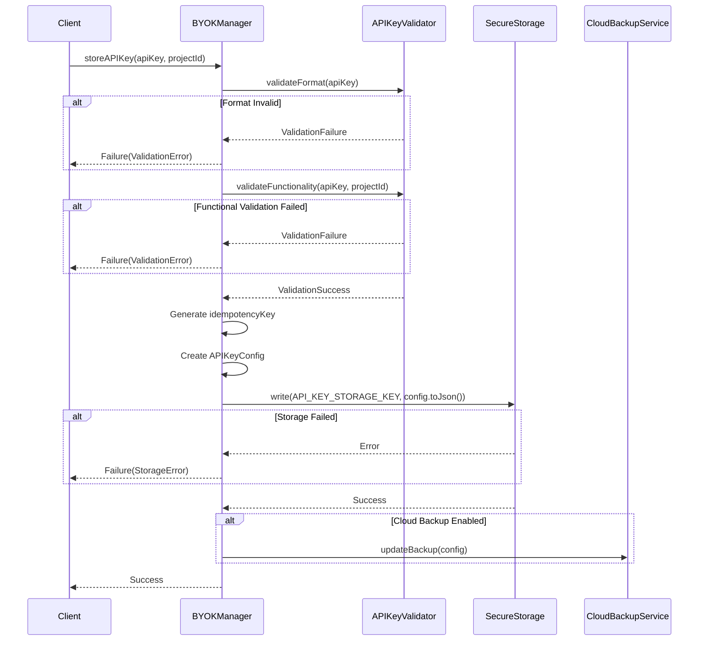
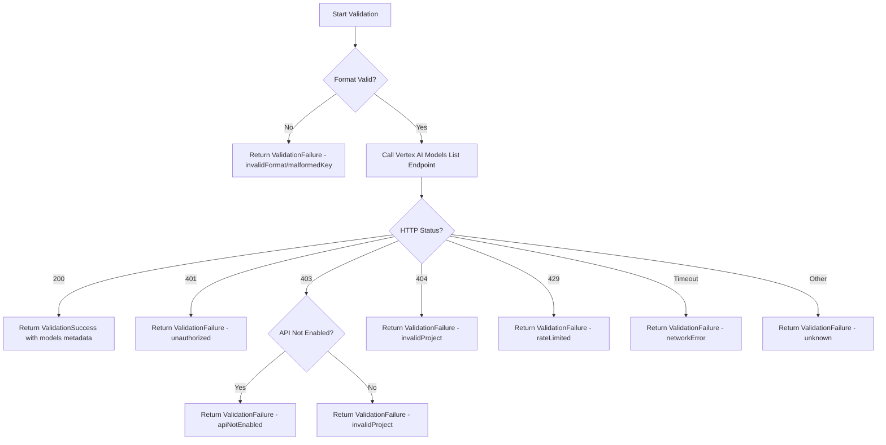
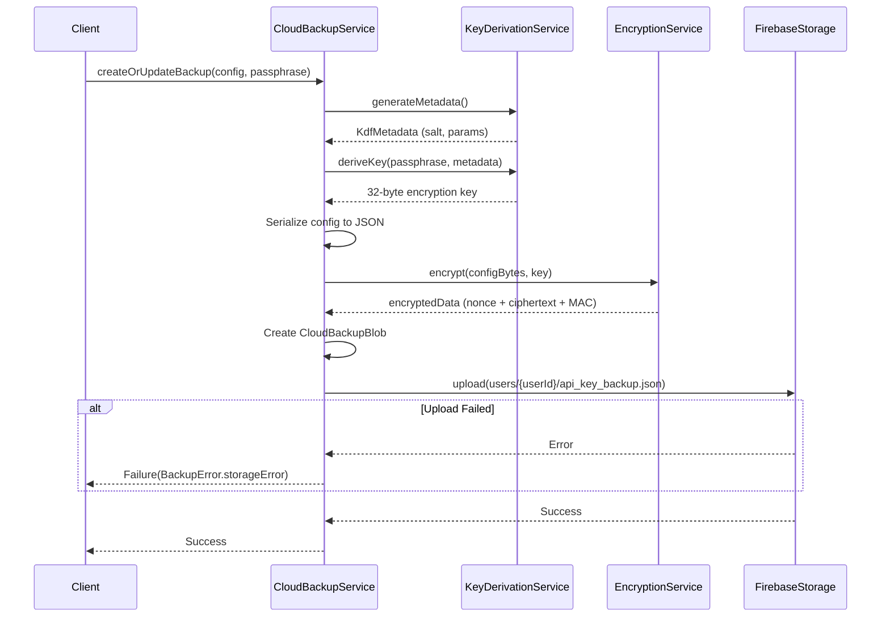
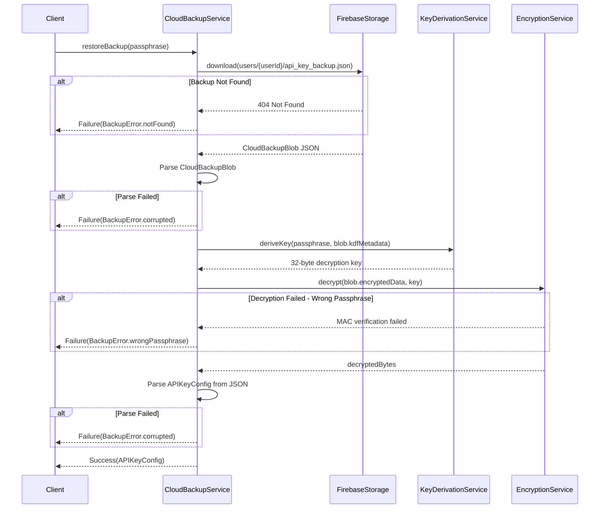
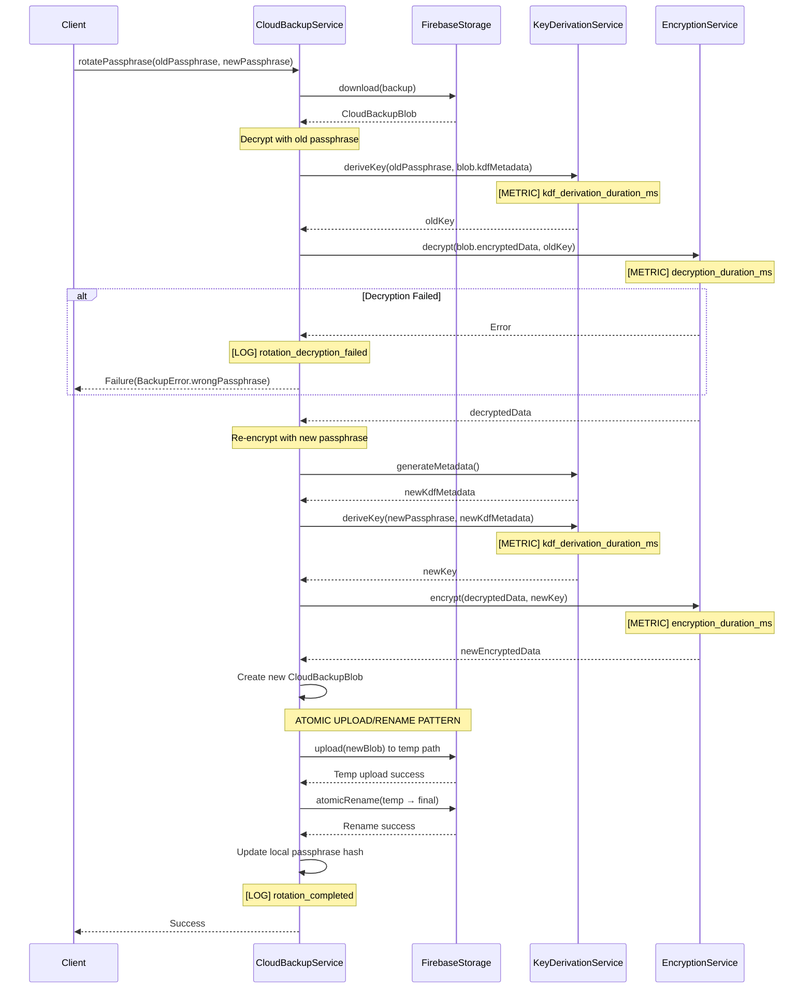

# BYOK System Design Specification

## Overview

This document specifies the design for the Bring Your Own Key (BYOK) system for StyleSync. The BYOK system enables users to securely manage their personal Vertex AI API keys with optional encrypted cloud backup.

### Components

1. **BYOKManager**: Orchestrates API key lifecycle (storage, retrieval, deletion)
2. **APIKeyValidator**: Validates API key format and functionality
3. **CloudBackupService**: Manages encrypted cloud backup of API keys

### Dependencies

The BYOK system integrates with existing core services:

- [`SecureStorageService`](../storage/secure_storage_service.dart:10): Platform-native secure storage
- [`EncryptionService`](../crypto/encryption_service.dart:4): AES-256-GCM encryption
- [`KeyDerivationService`](../crypto/key_derivation_service.dart:9): Argon2id/PBKDF2 key derivation

---

## Data Models

### APIKeyConfig

Represents a stored API key configuration.

```dart
/// Configuration for a stored Vertex AI API key.
class APIKeyConfig {
  /// The Vertex AI API key.
  final String apiKey;
  
  /// The Google Cloud project ID for Vertex AI requests.
  final String projectId;
  
  /// Timestamp when the key was first stored.
  final DateTime createdAt;
  
  /// Timestamp of the last successful validation.
  final DateTime lastValidated;
  
  /// Whether cloud backup is enabled for this key.
  final bool cloudBackupEnabled;
  
  /// Idempotency key for deduplication of operations.
  final String idempotencyKey;

  const APIKeyConfig({
    required this.apiKey,
    required this.projectId,
    required this.createdAt,
    required this.lastValidated,
    required this.cloudBackupEnabled,
    required this.idempotencyKey,
  });

  Map<String, dynamic> toJson() => {
    'apiKey': apiKey,
    'projectId': projectId,
    'createdAt': createdAt.toIso8601String(),
    'lastValidated': lastValidated.toIso8601String(),
    'cloudBackupEnabled': cloudBackupEnabled,
    'idempotencyKey': idempotencyKey,
  };

  factory APIKeyConfig.fromJson(Map<String, dynamic> json) {
    // Validate apiKey field
    final apiKey = json['apiKey'];
    if (apiKey == null) {
      throw ArgumentError("Field 'apiKey' is required but was null");
    }
    if (apiKey is! String) {
      throw ArgumentError("Field 'apiKey' must be a String, got ${apiKey.runtimeType}");
    }

    // Validate projectId field
    final projectId = json['projectId'];
    if (projectId == null) {
      throw ArgumentError("Field 'projectId' is required but was null");
    }
    if (projectId is! String) {
      throw ArgumentError("Field 'projectId' must be a String, got ${projectId.runtimeType}");
    }

    // Validate createdAt field
    final createdAt = json['createdAt'];
    if (createdAt == null) {
      throw ArgumentError("Field 'createdAt' is required but was null");
    }
    if (createdAt is! String) {
      throw ArgumentError("Field 'createdAt' must be a String, got ${createdAt.runtimeType}");
    }
    DateTime createdAtParsed;
    try {
      createdAtParsed = DateTime.parse(createdAt);
    } on FormatException {
      throw FormatException("Field 'createdAt' has invalid date format: $createdAt");
    }

    // Validate lastValidated field
    final lastValidated = json['lastValidated'];
    if (lastValidated == null) {
      throw ArgumentError("Field 'lastValidated' is required but was null");
    }
    if (lastValidated is! String) {
      throw ArgumentError("Field 'lastValidated' must be a String, got ${lastValidated.runtimeType}");
    }
    DateTime lastValidatedParsed;
    try {
      lastValidatedParsed = DateTime.parse(lastValidated);
    } on FormatException {
      throw FormatException("Field 'lastValidated' has invalid date format: $lastValidated");
    }

    // Validate cloudBackupEnabled field
    final cloudBackupEnabled = json['cloudBackupEnabled'];
    if (cloudBackupEnabled == null) {
      throw ArgumentError("Field 'cloudBackupEnabled' is required but was null");
    }
    if (cloudBackupEnabled is! bool) {
      throw ArgumentError("Field 'cloudBackupEnabled' must be a bool, got ${cloudBackupEnabled.runtimeType}");
    }

    // Validate idempotencyKey field
    final idempotencyKey = json['idempotencyKey'];
    if (idempotencyKey == null) {
      throw ArgumentError("Field 'idempotencyKey' is required but was null");
    }
    if (idempotencyKey is! String) {
      throw ArgumentError("Field 'idempotencyKey' must be a String, got ${idempotencyKey.runtimeType}");
    }

    // All validations passed, construct the object
    return APIKeyConfig(
      apiKey: apiKey,
      projectId: projectId,
      createdAt: createdAtParsed,
      lastValidated: lastValidatedParsed,
      cloudBackupEnabled: cloudBackupEnabled,
      idempotencyKey: idempotencyKey,
    );
  }

  APIKeyConfig copyWith({
    String? apiKey,
    String? projectId,
    DateTime? createdAt,
    DateTime? lastValidated,
    bool? cloudBackupEnabled,
    String? idempotencyKey,
  }) => APIKeyConfig(
    apiKey: apiKey ?? this.apiKey,
    projectId: projectId ?? this.projectId,
    createdAt: createdAt ?? this.createdAt,
    lastValidated: lastValidated ?? this.lastValidated,
    cloudBackupEnabled: cloudBackupEnabled ?? this.cloudBackupEnabled,
    idempotencyKey: idempotencyKey ?? this.idempotencyKey,
  );
}
```

### ValidationResult

Represents the result of an API key validation operation.

```dart
/// Result of an API key validation operation.
sealed class ValidationResult {
  const ValidationResult();
}

/// Validation succeeded.
class ValidationSuccess extends ValidationResult {
  /// Optional metadata from the validation (e.g., available models).
  final Map<String, dynamic>? metadata;
  
  const ValidationSuccess({this.metadata});
}

/// Validation failed.
class ValidationFailure extends ValidationResult {
  /// The type of validation failure.
  final ValidationFailureType type;
  
  /// Human-readable error message.
  final String message;
  
  /// Optional error code from the API.
  final String? errorCode;
  
  /// Optional underlying error.
  final Object? originalError;
  
  const ValidationFailure({
    required this.type,
    required this.message,
    this.errorCode,
    this.originalError,
  });
}

/// Types of validation failures.
enum ValidationFailureType {
  /// API key format is invalid.
  invalidFormat,
  
  /// API key is malformed (wrong length, invalid characters).
  malformedKey,
  
  /// API key is not authorized (invalid or revoked).
  unauthorized,
  
  /// Project ID is invalid or inaccessible.
  invalidProject,
  
  /// Vertex AI API is not enabled for the project.
  apiNotEnabled,
  
  /// Network error during validation.
  networkError,
  
  /// Rate limit exceeded during validation.
  rateLimited,
  
  /// Unknown or unexpected error.
  unknown,
}
```

### CloudBackupBlob

Represents the encrypted backup blob stored in Firebase Storage.

```dart
/// Encrypted backup blob structure for cloud storage.
class CloudBackupBlob {
  /// Schema version for forward compatibility.
  final int version;
  
  /// KDF metadata (algorithm, salt, parameters).
  final KdfMetadata kdfMetadata;
  
  /// Base64-encoded encrypted data (nonce + ciphertext + MAC).
  final String encryptedData;
  
  /// Timestamp when the backup was created.
  final DateTime createdAt;
  
  /// Timestamp when the backup was last updated.
  final DateTime updatedAt;

  const CloudBackupBlob({
    required this.version,
    required this.kdfMetadata,
    required this.encryptedData,
    required this.createdAt,
    required this.updatedAt,
  });

  static const int currentVersion = 1;

  Map<String, dynamic> toJson() => {
    'version': version,
    'kdf': kdfMetadata.toJson(),
    'encrypted_data': encryptedData,
    'created_at': createdAt.toIso8601String(),
    'updated_at': updatedAt.toIso8601String(),
  };

  factory CloudBackupBlob.fromJson(Map<String, dynamic> json) {
    final version = json['version'] as int;
    if (version > currentVersion) {
      throw FormatException(
        'Backup version $version is not supported. '
        'Please update the app to restore this backup.'
      );
    }
    return CloudBackupBlob(
      version: version,
      kdfMetadata: KdfMetadata.fromJson(json['kdf'] as Map<String, dynamic>),
      encryptedData: json['encrypted_data'] as String,
      createdAt: DateTime.parse(json['created_at'] as String),
      updatedAt: DateTime.parse(json['updated_at'] as String),
    );
  }
}
```

---

## BYOKManager Service

### Interface Definition

```dart
/// Manages API key lifecycle: storage, retrieval, and deletion.
abstract class BYOKManager {
  /// Stores an API key after validation.
  ///
  /// **Idempotency Behavior:**
  /// - If called with an `apiKey` that already exists in storage:
  ///   - The `lastValidated` field is refreshed to the current timestamp
  ///   - The existing `idempotencyKey` is preserved (not regenerated)
  ///   - The `createdAt` field remains unchanged
  ///   - Returns `Success` with the updated configuration
  /// - If called with a new `apiKey` (different from stored key):
  ///   - A new `idempotencyKey` is generated (UUID v4 + timestamp)
  ///   - Both `createdAt` and `lastValidated` are set to the current timestamp
  ///   - Returns `Success` with the new configuration
  ///
  /// **Concurrency:**
  /// - Concurrent calls to `storeAPIKey` are serialized internally using a mutex
  /// - If a store operation is already in progress, subsequent calls will wait
  ///   until the current operation completes before proceeding
  /// - This ensures consistent state and prevents race conditions during
  ///   validation and storage
  ///
  /// **Validation:**
  /// - The API key is validated using [APIKeyValidator] before storage
  /// - Format validation runs first via [APIKeyValidator.validateFormat]
  /// - Functional validation runs second via [APIKeyValidator.validateFunctionality]
  /// - Storage only occurs if both validations pass
  /// - See [APIKeyValidator] for detailed validation semantics
  ///
  /// Returns [Success] if the key was stored successfully.
  /// Returns [Failure] with [BYOKError] if validation or storage fails:
  /// - [ValidationError] if format or functional validation fails
  /// - [StorageError] if secure storage write fails
  ///
  /// If cloud backup is enabled, the backup is updated automatically after
  /// successful local storage.
  Future<Result<void>> storeAPIKey(String apiKey, String projectId);

  /// Retrieves the stored API key configuration.
  /// 
  /// Returns [Success] with [APIKeyConfig] if a key is stored.
  /// Returns [Failure] with [BYOKError.notFound] if no key is stored.
  Future<Result<APIKeyConfig>> getAPIKey();

  /// Deletes the stored API key and optionally the cloud backup.
  /// 
  /// [deleteCloudBackup]: If true, also deletes the cloud backup.
  /// 
  /// Returns [Success] if deletion was successful.
  /// Returns [Failure] if deletion fails.
  Future<Result<void>> deleteAPIKey({bool deleteCloudBackup = false});

  /// Updates an existing API key.
  /// 
  /// The new key is validated before replacing the old key.
  /// If cloud backup is enabled, the backup is re-encrypted.
  Future<Result<void>> updateAPIKey(String newApiKey, String projectId);

  /// Enables cloud backup with the given passphrase.
  /// 
  /// Derives an encryption key from the passphrase and encrypts
  /// the current API key configuration for cloud storage.
  Future<Result<void>> enableCloudBackup(String passphrase);

  /// Disables cloud backup and optionally deletes the backup.
  /// 
  /// [deleteBackup]: If true, deletes the existing cloud backup.
  Future<Result<void>> disableCloudBackup({bool deleteBackup = true});

  /// Restores an API key from cloud backup.
  /// 
  /// Fetches the encrypted backup and decrypts it using the passphrase.
  Future<Result<APIKeyConfig>> restoreFromCloudBackup(String passphrase);

  /// Checks if an API key is currently stored.
  Future<bool> hasStoredKey();

  /// Checks if cloud backup is enabled.
  Future<bool> isCloudBackupEnabled();

  /// Re-encrypts the cloud backup with a new passphrase.
  /// 
  /// Requires the old passphrase to decrypt and the new passphrase
  /// to re-encrypt. Does not require re-entry of the API key.
  /// 
  /// ### Atomicity Guarantees
  /// 
  /// This operation uses a **two-phase commit pattern**:
  /// - The original backup is preserved until the new blob is fully committed
  /// - Upload completes to a temporary path before any metadata is updated
  /// - Local passphrase hash is updated only after successful cloud commit
  /// 
  /// ### Rollback Strategy
  /// 
  /// On failure, the operation rolls back to preserve the original state:
  /// 1. Decrypt existing backup to a local staging object
  /// 2. Re-encrypt with the new passphrase
  /// 3. Upload new blob to a temporary path (`api_key_backup.tmp`)
  /// 4. Atomically rename temp blob to final path (upload-before-metadata-commit)
  /// 5. Update local passphrase hash only after successful rename
  /// 6. On failure at any step, delete the temp blob and preserve the original
  /// 
  /// ### Error Recovery
  /// 
  /// **Detecting incomplete state:**
  /// - Orphaned temp files (`api_key_backup.tmp`) indicate a prior failed rotation
  /// - Metadata inconsistency: local hash doesn't match cloud blob's KDF metadata
  /// 
  /// **Safe retry (idempotency):**
  /// - Each operation generates a unique operation ID stored in blob metadata
  /// - Orphaned temp files from previous operations are cleaned up before retry
  /// - Retrying with the same passphrases is always safe
  /// 
  /// **Restoring previous backup:**
  /// - If rename succeeds but local update fails, the original blob is re-uploaded
  /// - User is instructed to retry with their OLD passphrase if recovery fails
  /// 
  /// ### Metadata Update Ordering
  /// 
  /// The **upload-before-metadata-commit** pattern is critical:
  /// 1. New blob must be fully uploaded and verified before any metadata changes
  /// 2. Local passphrase hash is the last update (acts as the commit flag)
  /// 3. This ordering ensures the backup is never in an unrecoverable state
  /// 
  /// ### Cleanup Actions
  /// 
  /// To prevent inconsistent cloud backup state:
  /// - Temp files are deleted on rotation failure
  /// - If the authoritative blob is missing or corrupted after rotation,
  ///   cloud backup should be disabled and the user prompted to re-enable
  /// - Orphaned temp files are detected and cleaned at rotation start
  /// 
  /// **See also:** [Passphrase Rotation Flow](#passphrase-rotation-flow) (line 770+)
  /// for detailed implementation including retry/timeout configuration,
  /// observability requirements, and code examples.
  Future<Result<void>> rotateBackupPassphrase(
    String oldPassphrase,
    String newPassphrase,
  );
}
```

### Error Types

```dart
/// Errors that can occur during BYOK operations.
sealed class BYOKError {
  final String message;
  final Object? originalError;
  
  const BYOKError(this.message, {this.originalError});
}

/// API key validation failed.
class ValidationError extends BYOKError {
  final ValidationResult validationResult;
  
  const ValidationError(super.message, this.validationResult, {super.originalError});
}

/// No API key is stored.
class NotFoundError extends BYOKError {
  const NotFoundError() : super('No API key is stored');
}

/// Secure storage operation failed.
class StorageError extends BYOKError {
  const StorageError(super.message, {super.originalError});
}

/// Cloud backup operation failed.
class BackupError extends BYOKError {
  final BackupErrorType type;
  
  const BackupError(super.message, this.type, {super.originalError});
}

enum BackupErrorType {
  /// Backup does not exist.
  notFound,
  
  /// Passphrase is incorrect.
  wrongPassphrase,
  
  /// Backup is corrupted.
  corrupted,
  
  /// Network error during backup operation.
  networkError,
  
  /// Firebase Storage error.
  storageError,
}

/// Encryption or decryption failed.
class CryptoError extends BYOKError {
  const CryptoError(super.message, {super.originalError});
}
```

### Implementation Logic

#### storeAPIKey Flow



#### Storage Keys

```dart
/// Storage keys used by BYOKManager.
class BYOKStorageKeys {
  /// Key for the API key configuration in secure storage.
  static const String apiKeyConfig = 'stylesync_api_key_config';
  
  /// Key for the cloud backup passphrase hash (for verification).
  static const String backupPassphraseHash = 'stylesync_backup_passphrase_hash';
  
  /// Key for the cloud backup enabled flag.
  static const String cloudBackupEnabled = 'stylesync_cloud_backup_enabled';
}
```

---

## APIKeyValidator Service

### Interface Definition

```dart
/// Validates Vertex AI API keys for format and functionality.
abstract class APIKeyValidator {
  /// Validates the format of an API key.
  /// 
  /// Checks:
  /// - Key starts with expected prefix (e.g., 'AIza')
  /// - Key has correct length (39 characters for Vertex AI)
  /// - Key contains only valid characters (alphanumeric, underscore, hyphen)
  /// 
  /// Returns [ValidationSuccess] if format is valid.
  /// Returns [ValidationFailure] with [ValidationFailureType.invalidFormat]
  /// or [ValidationFailureType.malformedKey] if invalid.
  ValidationResult validateFormat(String apiKey);

  /// Validates the functionality of an API key by making a test API call.
  /// 
  /// Makes a request to the Vertex AI models list endpoint:
  /// `GET https://{region}-aiplatform.googleapis.com/v1/projects/{projectId}/locations/{region}/models`
  /// 
  /// Returns [ValidationSuccess] with available models metadata if successful.
  /// Returns [ValidationFailure] with specific error type if validation fails.
  Future<ValidationResult> validateFunctionality(
    String apiKey,
    String projectId, {
    String region = 'us-central1',
  });
}
```

### Format Validation Logic

```dart
/// Validates API key format according to Google Cloud API key specifications.
ValidationResult validateFormat(String apiKey) {
  // Check for empty or whitespace-only input
  if (apiKey.trim().isEmpty) {
    return const ValidationFailure(
      type: ValidationFailureType.invalidFormat,
      message: 'API key cannot be empty',
    );
  }

  // Trim whitespace
  final trimmedKey = apiKey.trim();

  // Check prefix (Google API keys typically start with 'AIza')
  if (!trimmedKey.startsWith('AIza')) {
    return const ValidationFailure(
      type: ValidationFailureType.invalidFormat,
      message: 'API key must start with "AIza"',
    );
  }

  // Check length (Google API keys are 39 characters)
  if (trimmedKey.length != 39) {
    return ValidationFailure(
      type: ValidationFailureType.malformedKey,
      message: 'API key must be exactly 39 characters (got ${trimmedKey.length})',
    );
  }

  // Check for valid characters (alphanumeric, underscore, hyphen)
  final validCharPattern = RegExp(r'^[A-Za-z0-9_-]+$');
  if (!validCharPattern.hasMatch(trimmedKey)) {
    return const ValidationFailure(
      type: ValidationFailureType.malformedKey,
      message: 'API key contains invalid characters',
    );
  }

  return const ValidationSuccess();
}
```

### Functional Validation Logic

```dart
/// Validates API key functionality by calling Vertex AI models list endpoint.
Future<ValidationResult> validateFunctionality(
  String apiKey,
  String projectId, {
  String region = 'us-central1',
}) async {
  // Construct the Vertex AI models list endpoint URL
  final url = Uri.parse(
    'https://$region-aiplatform.googleapis.com/v1/'
    'projects/$projectId/locations/$region/models'
  );

  try {
    final response = await httpClient.get(
      url,
      headers: {
        'x-goog-api-key': apiKey,
        'Content-Type': 'application/json',
      },
    ).timeout(const Duration(seconds: 10));

    switch (response.statusCode) {
      case 200:
        // Success - parse available models
        final body = jsonDecode(response.body) as Map<String, dynamic>;
        return ValidationSuccess(metadata: body);
      
      case 401:
        return const ValidationFailure(
          type: ValidationFailureType.unauthorized,
          message: 'API key is invalid or has been revoked',
          errorCode: '401',
        );
      
      case 403:
        // Check if it's a project access issue or API not enabled
        final body = jsonDecode(response.body) as Map<String, dynamic>;
        final errorMessage = body['error']?['message'] as String? ?? '';
        
        if (errorMessage.contains('API not enabled')) {
          return ValidationFailure(
            type: ValidationFailureType.apiNotEnabled,
            message: 'Vertex AI API is not enabled for project "$projectId". '
                'Please enable it in the Google Cloud Console.',
            errorCode: '403',
          );
        }
        
        return ValidationFailure(
          type: ValidationFailureType.invalidProject,
          message: 'Access denied to project "$projectId". '
              'Please verify the project ID and API key permissions.',
          errorCode: '403',
        );
      
      case 404:
        return ValidationFailure(
          type: ValidationFailureType.invalidProject,
          message: 'Project "$projectId" not found. '
              'Please verify the project ID.',
          errorCode: '404',
        );
      
      case 429:
        return const ValidationFailure(
          type: ValidationFailureType.rateLimited,
          message: 'Rate limit exceeded. Please try again later.',
          errorCode: '429',
        );
      
      default:
        return ValidationFailure(
          type: ValidationFailureType.unknown,
          message: 'Unexpected error (HTTP ${response.statusCode})',
          errorCode: response.statusCode.toString(),
        );
    }
  } on TimeoutException catch (e) {
    return ValidationFailure(
      type: ValidationFailureType.networkError,
      message: 'Request timed out. Please check your network connection.',
      originalError: e,
    );
  } on SocketException catch (e) {
    return ValidationFailure(
      type: ValidationFailureType.networkError,
      message: 'Network error. Please check your internet connection.',
      originalError: e,
    );
  } catch (e) {
    return ValidationFailure(
      type: ValidationFailureType.unknown,
      message: 'An unexpected error occurred: ${e.toString()}',
      originalError: e,
    );
  }
}
```

### Validation Flow Diagram



---

## CloudBackupService

### Interface Definition

```dart
/// Manages encrypted cloud backup of API keys.
abstract class CloudBackupService {
  /// Creates or updates an encrypted backup of the API key configuration.
  /// 
  /// Derives an encryption key from the passphrase using [KeyDerivationService],
  /// encrypts the configuration using [EncryptionService], and uploads to
  /// Firebase Storage at `users/{userId}/api_key_backup.json`.
  Future<Result<void>> createOrUpdateBackup(
    APIKeyConfig config,
    String passphrase,
  );

  /// Restores an API key configuration from cloud backup.
  /// 
  /// Downloads the encrypted backup from Firebase Storage, derives the
  /// decryption key from the passphrase, and decrypts the configuration.
  Future<Result<APIKeyConfig>> restoreBackup(String passphrase);

  /// Deletes the cloud backup.
  Future<Result<void>> deleteBackup();

  /// Checks if a cloud backup exists for the current user.
  Future<bool> backupExists();

  /// Re-encrypts the backup with a new passphrase without downloading
  /// the plaintext API key.
  /// 
  /// This is used for passphrase rotation. The backup is decrypted with
  /// the old passphrase and re-encrypted with the new passphrase.
  Future<Result<void>> rotatePassphrase(
    String oldPassphrase,
    String newPassphrase,
  );

  /// Verifies that the provided passphrase can decrypt the backup.
  /// 
  /// Returns true if the passphrase is correct, false otherwise.
  Future<Result<bool>> verifyPassphrase(String passphrase);
}
```

### Backup Flow



### Restore Flow



### Firebase Storage Path

```
users/{userId}/api_key_backup.json
```

Where `{userId}` is the Firebase Authentication UID of the current user.

#### Firebase Storage Security Rules

The following security rules **MUST** be deployed to Firebase Storage to protect backup files:

```javascript
rules_version = '2';
service firebase.storage {
  match /b/{bucket}/o {
    // Primary backup path
    match /users/{userId}/api_key_backup.json {
      allow read: if request.auth != null && request.auth.uid == userId;
      allow write: if request.auth != null && request.auth.uid == userId && request.resource.size > 0;
    }
    
    // Temporary file path for passphrase rotation
    match /backups/{userId}/api_key_backup.tmp {
      allow read, write: if request.auth != null && request.auth.uid == userId && request.resource.size > 0;
    }
  }
}
```

#### Security Notes

1. **`rules_version = '2'`**: Version 2 is required for improved security semantics, including proper handling of recursive wildcards and stricter default deny behavior. Version 1 rules have known security pitfalls and should not be used.

2. **Enumeration Protection**: Users cannot list or enumerate other users' backups. The rules only permit access to specific file paths where `request.auth.uid == userId`. There is no `list` permission granted, preventing directory enumeration attacks.

3. **Empty Overwrite Prevention**: The `request.resource.size > 0` condition on write operations prevents accidental data loss from empty file uploads. This guards against:
   - Client bugs that might upload empty content
   - Partial upload failures that could corrupt backups
   - Malicious attempts to wipe backup data

4. **Authentication Required**: All operations require `request.auth != null`, ensuring only authenticated Firebase users can access storage. Unauthenticated requests are rejected before path matching occurs.

### Backup Blob JSON Schema

```json
{
  "version": 1,
  "kdf": {
    "algorithm": "argon2id",
    "salt": "base64_encoded_16_byte_salt",
    "iterations": 3,
    "memory": 65536,
    "parallelism": 4
  },
  "encrypted_data": "base64_encoded_nonce_ciphertext_mac",
  "created_at": "2025-01-21T22:00:00.000Z",
  "updated_at": "2025-01-21T22:00:00.000Z"
}
```

### Passphrase Rotation Flow

The passphrase rotation operation is a critical security function that must be implemented with strong atomicity guarantees to prevent data loss or corruption. This section documents the atomic upload/rename pattern, rollback/recovery procedures, retry strategies, and observability requirements.

#### Overview



#### Atomic Upload/Rename Pattern

To ensure data integrity during passphrase rotation, the service **MUST** implement an atomic upload/rename pattern:

1. **Upload to Temporary Path**: The re-encrypted `CloudBackupBlob` is first uploaded to a temporary path:
   ```
   backups/{userId}/api_key_backup.tmp
   ```

2. **Atomic Rename/Commit**: After successful upload, perform an atomic rename operation to replace the existing blob:
   ```
   backups/{userId}/api_key_backup.tmp → backups/{userId}/api_key_backup.json
   ```

3. **Retain Original Until Swap**: The original backup at `api_key_backup.json` is preserved until the atomic rename completes successfully.

4. **Update Local State Last**: The local passphrase hash (stored in secure storage) is updated **only after** the atomic rename succeeds.

##### Firebase Storage Implementation

```dart
/// Atomic passphrase rotation with upload/rename pattern.
Future<Result<void>> rotatePassphrase(
  String oldPassphrase,
  String newPassphrase,
) async {
  final operationId = _generateOperationId();
  final stopwatch = Stopwatch()..start();
  
  _logger.info('rotation_started', {'operation_id': operationId});
  _metrics.increment('passphrase_rotation_attempts');
  
  try {
    // 1. Download existing backup
    final downloadResult = await _downloadBackupWithRetry();
    if (downloadResult.isFailure) {
      return downloadResult.mapError((e) => e);
    }
    final blob = downloadResult.value;
    
    // 2. Decrypt with old passphrase
    final decryptResult = await _decryptBlob(blob, oldPassphrase, operationId);
    if (decryptResult.isFailure) {
      return decryptResult.mapError((e) => e);
    }
    final decryptedData = decryptResult.value;
    
    // 3. Re-encrypt with new passphrase
    final encryptResult = await _encryptData(decryptedData, newPassphrase, operationId);
    if (encryptResult.isFailure) {
      return encryptResult.mapError((e) => e);
    }
    final newBlob = encryptResult.value;
    
    // 4. Upload to temporary path
    final tempPath = 'backups/$userId/api_key_backup.tmp';
    final uploadResult = await _uploadWithRetry(newBlob, tempPath, operationId);
    if (uploadResult.isFailure) {
      return uploadResult.mapError((e) => e);
    }
    
    // 5. Atomic rename with retry
    final renameResult = await _atomicRenameWithRetry(
      sourcePath: tempPath,
      destinationPath: 'backups/$userId/api_key_backup.json',
      operationId: operationId,
    );
    if (renameResult.isFailure) {
      // Cleanup temp file on rename failure
      await _cleanupTempFile(tempPath, operationId);
      return renameResult.mapError((e) => e);
    }
    
    // 6. Update local passphrase hash (only after successful rename)
    final localUpdateResult = await _updateLocalPassphraseHash(
      newPassphrase,
      operationId,
    );
    if (localUpdateResult.isFailure) {
      // CRITICAL: Rename succeeded but local update failed
      // Initiate recovery procedure
      return await _recoverFromLocalUpdateFailure(
        blob: blob,
        newBlob: newBlob,
        operationId: operationId,
      );
    }
    
    stopwatch.stop();
    _metrics.recordDuration('passphrase_rotation_duration_ms', stopwatch.elapsedMilliseconds);
    _logger.info('rotation_completed', {
      'operation_id': operationId,
      'duration_ms': stopwatch.elapsedMilliseconds,
    });
    
    return const Success(null);
  } catch (e, stackTrace) {
    _logger.error('rotation_unexpected_error', {
      'operation_id': operationId,
      'error': e.toString(),
    }, stackTrace);
    _metrics.increment('passphrase_rotation_unexpected_errors');
    return Failure(BackupError(
      'Unexpected error during passphrase rotation',
      BackupErrorType.unknown,
      originalError: e,
    ));
  }
}
```

#### Rollback and Recovery Procedures

The rotation operation must handle failures at each stage with appropriate rollback and recovery:

##### Failure Scenarios and Recovery

| Failure Point | State | Recovery Action |
|---------------|-------|-----------------|
| Download failed | No changes | Return error; no cleanup needed |
| Decryption failed | No changes | Return `BackupError.wrongPassphrase`; no cleanup needed |
| Encryption failed | No changes | Return `BackupError.cryptoError`; no cleanup needed |
| Temp upload failed | No changes | Return error; no cleanup needed |
| Rename failed | Temp file exists, original intact | Retry rename with backoff; cleanup temp on final failure |
| Local state update failed | New blob committed, old passphrase hash | Restore original blob from retained copy |

##### Rename Failure Recovery

```dart
/// Performs atomic rename with exponential backoff retry.
Future<Result<void>> _atomicRenameWithRetry({
  required String sourcePath,
  required String destinationPath,
  required String operationId,
}) async {
  const maxRetries = 3;
  const baseDelayMs = 500;
  
  for (var attempt = 1; attempt <= maxRetries; attempt++) {
    try {
      _logger.debug('rename_attempt', {
        'operation_id': operationId,
        'attempt': attempt,
        'source': sourcePath,
        'destination': destinationPath,
      });
      
      // Firebase Storage doesn't have native rename; implement as copy + delete
      // Use metadata to ensure atomicity
      final sourceRef = _storage.ref(sourcePath);
      final destRef = _storage.ref(destinationPath);
      
      // Copy with metadata preservation
      final sourceData = await sourceRef.getData();
      if (sourceData == null) {
        throw FirebaseException(
          plugin: 'firebase_storage',
          message: 'Source file not found during rename',
        );
      }
      
      // Upload to destination (overwrites existing)
      await destRef.putData(
        sourceData,
        SettableMetadata(
          customMetadata: {'rotation_operation_id': operationId},
        ),
      ).timeout(const Duration(seconds: 30));
      
      // Delete source (temp file)
      await sourceRef.delete().timeout(const Duration(seconds: 10));
      
      _logger.info('rename_succeeded', {
        'operation_id': operationId,
        'attempt': attempt,
      });
      _metrics.recordHistogram('rename_attempts', attempt);
      
      return const Success(null);
    } on FirebaseException catch (e) {
      _logger.warn('rename_attempt_failed', {
        'operation_id': operationId,
        'attempt': attempt,
        'error': e.message,
      });
      
      if (attempt == maxRetries) {
        _metrics.increment('rename_final_failures');
        return Failure(BackupError(
          'Failed to commit backup after $maxRetries attempts: ${e.message}',
          BackupErrorType.storageError,
          originalError: e,
        ));
      }
      
      // Exponential backoff: 500ms, 1000ms, 2000ms
      final delayMs = baseDelayMs * (1 << (attempt - 1));
      await Future.delayed(Duration(milliseconds: delayMs));
    } on TimeoutException catch (e) {
      _logger.warn('rename_timeout', {
        'operation_id': operationId,
        'attempt': attempt,
      });
      
      if (attempt == maxRetries) {
        _metrics.increment('rename_timeout_failures');
        return Failure(BackupError(
          'Rename operation timed out after $maxRetries attempts',
          BackupErrorType.networkError,
          originalError: e,
        ));
      }
      
      final delayMs = baseDelayMs * (1 << (attempt - 1));
      await Future.delayed(Duration(milliseconds: delayMs));
    }
  }
  
  // Should not reach here
  return Failure(const BackupError(
    'Rename failed unexpectedly',
    BackupErrorType.unknown,
  ));
}
```

##### Local State Update Failure Recovery

```dart
/// Recovers from local passphrase hash update failure.
/// 
/// At this point, the new blob is committed to Firebase Storage,
/// but the local passphrase hash still references the old passphrase.
/// We must restore the original blob to maintain consistency.
Future<Result<void>> _recoverFromLocalUpdateFailure({
  required CloudBackupBlob blob,
  required CloudBackupBlob newBlob,
  required String operationId,
}) async {
  _logger.error('local_update_failed_initiating_recovery', {
    'operation_id': operationId,
  });
  _metrics.increment('local_update_recovery_attempts');
  
  try {
    // Re-upload the original blob to restore consistency
    final restoreResult = await _uploadWithRetry(
      blob,
      'backups/$userId/api_key_backup.json',
      operationId,
    );
    
    if (restoreResult.isFailure) {
      // CRITICAL: Cannot restore original blob
      // Surface clear error to user with recovery instructions
      _logger.error('recovery_failed_critical', {
        'operation_id': operationId,
        'error': 'Could not restore original backup',
      });
      _metrics.increment('critical_recovery_failures');
      
      return Failure(BackupError(
        'Passphrase rotation failed and recovery was unsuccessful. '
        'Your backup may be in an inconsistent state. '
        'Please try restoring with your OLD passphrase, then retry rotation. '
        'Error code: ROTATION_RECOVERY_FAILED',
        BackupErrorType.storageError,
        originalError: restoreResult.error,
      ));
    }
    
    _logger.info('recovery_succeeded', {'operation_id': operationId});
    _metrics.increment('local_update_recovery_successes');
    
    return Failure(BackupError(
      'Passphrase rotation failed during local state update. '
      'Your backup has been restored to its previous state. '
      'Please try again. Error code: ROTATION_LOCAL_UPDATE_FAILED',
      BackupErrorType.storageError,
    ));
  } catch (e, stackTrace) {
    _logger.error('recovery_unexpected_error', {
      'operation_id': operationId,
      'error': e.toString(),
    }, stackTrace);
    
    return Failure(BackupError(
      'Critical error during recovery. Please contact support. '
      'Error code: ROTATION_RECOVERY_EXCEPTION',
      BackupErrorType.unknown,
      originalError: e,
    ));
  }
}
```

##### Cleanup Operations Order

When cleanup is required, operations must be performed in this order:

1. **Delete temporary file** (if exists): `backups/{userId}/api_key_backup.tmp`
2. **Verify original blob integrity** (if recovery was attempted)
3. **Log cleanup completion** with operation ID for traceability

```dart
/// Cleans up temporary file after failed rotation.
Future<void> _cleanupTempFile(String tempPath, String operationId) async {
  try {
    _logger.debug('cleanup_temp_file_started', {
      'operation_id': operationId,
      'path': tempPath,
    });
    
    await _storage.ref(tempPath).delete().timeout(
      const Duration(seconds: 10),
    );
    
    _logger.info('cleanup_temp_file_completed', {
      'operation_id': operationId,
    });
  } on FirebaseException catch (e) {
    // Log but don't fail - temp file will be orphaned but won't affect functionality
    _logger.warn('cleanup_temp_file_failed', {
      'operation_id': operationId,
      'error': e.message,
    });
  }
}
```

#### Retry and Timeout Guidance

##### Recommended Configuration

| Operation | Timeout | Max Retries | Backoff Strategy |
|-----------|---------|-------------|------------------|
| Download backup | 30 seconds | 3 | Exponential (1s, 2s, 4s) |
| Upload to temp path | 60 seconds | 3 | Exponential (1s, 2s, 4s) |
| Atomic rename (copy) | 30 seconds | 3 | Exponential (500ms, 1s, 2s) |
| Atomic rename (delete) | 10 seconds | 2 | Exponential (500ms, 1s) |
| Local state update | 5 seconds | 2 | Linear (500ms) |

##### Exponential Backoff Implementation

```dart
/// Calculates delay for exponential backoff.
/// 
/// Formula: baseDelay * 2^(attempt - 1) + jitter
/// Jitter: Random value between 0 and 10% of calculated delay
Duration calculateBackoff({
  required int attempt,
  required Duration baseDelay,
  double jitterFactor = 0.1,
}) {
  final exponentialMs = baseDelay.inMilliseconds * (1 << (attempt - 1));
  final jitterMs = (exponentialMs * jitterFactor * _random.nextDouble()).round();
  return Duration(milliseconds: exponentialMs + jitterMs);
}
```

##### Idempotency Considerations

To handle partial failures and retries safely:

1. **Operation ID**: Generate a unique operation ID at the start of each rotation attempt
2. **Metadata Tagging**: Include operation ID in Firebase Storage metadata for traceability
3. **Duplicate Detection**: Before starting rotation, check for orphaned temp files from previous failed attempts
4. **Safe Retry**: If a temp file exists with a different operation ID, delete it before proceeding

```dart
/// Checks for and cleans up orphaned temp files from previous failed rotations.
Future<void> _cleanupOrphanedTempFiles(String operationId) async {
  final tempPath = 'backups/$userId/api_key_backup.tmp';
  
  try {
    final tempRef = _storage.ref(tempPath);
    final metadata = await tempRef.getMetadata();
    
    final existingOperationId = metadata.customMetadata?['rotation_operation_id'];
    if (existingOperationId != null && existingOperationId != operationId) {
      _logger.warn('orphaned_temp_file_found', {
        'operation_id': operationId,
        'orphaned_operation_id': existingOperationId,
      });
      await tempRef.delete();
      _metrics.increment('orphaned_temp_files_cleaned');
    }
  } on FirebaseException catch (e) {
    if (e.code != 'object-not-found') {
      _logger.warn('orphan_cleanup_check_failed', {
        'operation_id': operationId,
        'error': e.message,
      });
    }
    // File doesn't exist - no cleanup needed
  }
}
```

#### Observability Requirements

##### Metrics

The following metrics **MUST** be emitted during passphrase rotation:

| Metric Name | Type | Description |
|-------------|------|-------------|
| `passphrase_rotation_attempts` | Counter | Total rotation attempts |
| `passphrase_rotation_successes` | Counter | Successful rotations |
| `passphrase_rotation_failures` | Counter | Failed rotations (by error type) |
| `passphrase_rotation_duration_ms` | Histogram | End-to-end rotation duration |
| `kdf_derivation_duration_ms` | Histogram | Key derivation time |
| `encryption_duration_ms` | Histogram | Encryption operation time |
| `decryption_duration_ms` | Histogram | Decryption operation time |
| `storage_upload_duration_ms` | Histogram | Firebase upload time |
| `rename_attempts` | Histogram | Number of rename attempts per rotation |
| `critical_recovery_failures` | Counter | Unrecoverable failures |

##### Structured Logging

All log entries **MUST** include:

- `operation_id`: Unique identifier for the rotation operation
- `timestamp`: ISO 8601 timestamp
- `user_id`: Hashed or anonymized user identifier (for privacy)

**Log Events:**

| Event | Level | Fields | Description |
|-------|-------|--------|-------------|
| `rotation_started` | INFO | operation_id | Rotation operation initiated |
| `rotation_completed` | INFO | operation_id, duration_ms | Successful completion |
| `rotation_decryption_failed` | WARN | operation_id, error_type | Old passphrase incorrect |
| `rename_attempt` | DEBUG | operation_id, attempt, source, destination | Rename attempt details |
| `rename_succeeded` | INFO | operation_id, attempt | Rename completed |
| `rename_attempt_failed` | WARN | operation_id, attempt, error | Rename attempt failed |
| `local_update_failed_initiating_recovery` | ERROR | operation_id | Critical: initiating recovery |
| `recovery_succeeded` | INFO | operation_id | Recovery completed |
| `recovery_failed_critical` | ERROR | operation_id, error | Unrecoverable state |
| `cleanup_temp_file_started` | DEBUG | operation_id, path | Cleanup initiated |
| `cleanup_temp_file_completed` | INFO | operation_id | Cleanup successful |
| `orphaned_temp_file_found` | WARN | operation_id, orphaned_operation_id | Stale temp file detected |

##### Distributed Tracing

For end-to-end traceability, implement OpenTelemetry-compatible tracing:

```dart
/// Wraps rotation operation with distributed tracing.
Future<Result<void>> rotatePassphraseWithTracing(
  String oldPassphrase,
  String newPassphrase,
) async {
  final span = _tracer.startSpan('CloudBackupService.rotatePassphrase');
  
  try {
    span.setAttribute('operation_type', 'passphrase_rotation');
    
    // Download span
    final downloadSpan = _tracer.startSpan('download_backup', parent: span);
    final downloadResult = await _downloadBackupWithRetry();
    downloadSpan.end();
    
    if (downloadResult.isFailure) {
      span.setStatus(SpanStatus.error, 'Download failed');
      return downloadResult;
    }
    
    // Decrypt span
    final decryptSpan = _tracer.startSpan('decrypt_with_old_passphrase', parent: span);
    decryptSpan.setAttribute('kdf_algorithm', downloadResult.value.kdfMetadata.algorithm);
    // ... decryption logic
    decryptSpan.end();
    
    // Encrypt span
    final encryptSpan = _tracer.startSpan('encrypt_with_new_passphrase', parent: span);
    // ... encryption logic
    encryptSpan.end();
    
    // Upload span
    final uploadSpan = _tracer.startSpan('upload_to_temp', parent: span);
    // ... upload logic
    uploadSpan.end();
    
    // Rename span
    final renameSpan = _tracer.startSpan('atomic_rename', parent: span);
    // ... rename logic
    renameSpan.end();
    
    span.setStatus(SpanStatus.ok);
    return const Success(null);
  } catch (e, stackTrace) {
    span.setStatus(SpanStatus.error, e.toString());
    span.recordException(e, stackTrace: stackTrace);
    rethrow;
  } finally {
    span.end();
  }
}
```

##### Error Categorization for Dashboards

Errors should be categorized for monitoring dashboards:

| Category | Error Types | Alert Threshold |
|----------|-------------|-----------------|
| **User Error** | `wrongPassphrase` | No alert (expected) |
| **Transient** | `networkError`, `storageError` (retryable) | > 10% failure rate |
| **Infrastructure** | `storageError` (quota, permissions) | Any occurrence |
| **Critical** | `ROTATION_RECOVERY_FAILED`, `ROTATION_RECOVERY_EXCEPTION` | Any occurrence |
| **Bug** | `unknown`, unexpected exceptions | Any occurrence |

##### BackupError Type Extensions

To support the detailed error reporting required for passphrase rotation, extend `BackupErrorType`:

```dart
enum BackupErrorType {
  /// Backup does not exist.
  notFound,
  
  /// Passphrase is incorrect.
  wrongPassphrase,
  
  /// Backup is corrupted.
  corrupted,
  
  /// Network error during backup operation.
  networkError,
  
  /// Firebase Storage error.
  storageError,
  
  /// Encryption or decryption operation failed.
  cryptoError,
  
  /// Atomic rename operation failed after retries.
  renameFailure,
  
  /// Local state update failed; recovery attempted.
  localUpdateFailure,
  
  /// Critical: Recovery from failure was unsuccessful.
  recoveryFailure,
  
  /// Unknown or unexpected error.
  unknown,
}
```

---

## Error Handling Strategies

### BYOKManager Errors

| Error Type | Cause | Recovery Strategy |
|------------|-------|-------------------|
| `ValidationError` | API key format or functional validation failed | Display specific error message to user; prompt to re-enter key |
| `NotFoundError` | No API key stored | Redirect to API key setup flow |
| `StorageError` | Secure storage read/write failed | Retry up to 3 times; if persistent, prompt user to restart app |
| `BackupError.notFound` | Cloud backup doesn't exist | Prompt user to set up cloud backup or enter key manually |
| `BackupError.wrongPassphrase` | Incorrect passphrase for backup | Prompt user to re-enter passphrase; offer "forgot passphrase" flow |
| `BackupError.corrupted` | Backup data is corrupted | Prompt user to delete backup and re-create; log error for debugging |
| `BackupError.networkError` | Network failure during backup operation | Retry with exponential backoff; show offline indicator |
| `BackupError.storageError` | Firebase Storage error | Retry with exponential backoff; check Firebase quotas |
| `CryptoError` | Encryption/decryption failed | Log error; prompt user to contact support |

### APIKeyValidator Errors

| Error Type | Cause | User Message |
|------------|-------|--------------|
| `invalidFormat` | Key doesn't start with 'AIza' | "API key format is invalid. Keys should start with 'AIza'." |
| `malformedKey` | Wrong length or invalid characters | "API key appears to be incomplete or contains invalid characters." |
| `unauthorized` | Key is invalid or revoked | "This API key is invalid or has been revoked. Please generate a new key." |
| `invalidProject` | Project ID is wrong or inaccessible | "Cannot access project '{projectId}'. Please verify the project ID." |
| `apiNotEnabled` | Vertex AI API not enabled | "Vertex AI API is not enabled for this project. [Enable it here](link)" |
| `networkError` | Network connectivity issue | "Network error. Please check your internet connection and try again." |
| `rateLimited` | Too many validation attempts | "Too many requests. Please wait a moment and try again." |
| `unknown` | Unexpected error | "An unexpected error occurred. Please try again or contact support." |

### CloudBackupService Errors

| Error Type | Cause | Recovery Strategy |
|------------|-------|-------------------|
| `notFound` | Backup doesn't exist in Firebase Storage | Inform user no backup exists; offer to create one |
| `wrongPassphrase` | Passphrase doesn't match | Allow 3 attempts; then offer "forgot passphrase" flow |
| `corrupted` | Backup JSON is malformed or version unsupported | Offer to delete and re-create backup; log for debugging |
| `networkError` | Firebase Storage network error | Retry with exponential backoff (1s, 2s, 4s); max 3 retries |
| `storageError` | Firebase Storage permission or quota error | Check Firebase rules; verify user authentication |

---

## Security Considerations

### API Key Protection

1. **Memory Protection**: API keys are loaded into memory only when needed and cleared immediately after use.
2. **No Logging**: API keys are never logged, even in debug builds.
3. **Secure Storage**: Keys are stored using platform-native secure storage (iOS Keychain, Android Keystore).
4. **No Backend Transmission**: Keys are never transmitted to any backend server except for encrypted cloud backup.

### Cloud Backup Security

1. **End-to-End Encryption**: Backups are encrypted client-side before upload.
2. **Key Derivation**: Encryption keys are derived from user passphrase using Argon2id (or PBKDF2 fallback).
3. **Unique Salt**: Each backup uses a unique cryptographically-random salt.
4. **Nonce Uniqueness**: Each encryption operation uses a unique 96-bit nonce.
5. **MAC Verification**: AES-GCM provides authenticated encryption; tampering is detected.
6. **Passphrase Never Stored**: The passphrase is never stored; only the derived key is used.

### Validation Security

1. **Rate Limiting**: Validation requests are rate-limited to prevent abuse.
2. **Timeout**: Validation requests timeout after 10 seconds to prevent hanging.
3. **Error Sanitization**: Error messages don't expose sensitive details about the validation process.

---

## Implementation Checklist

### Task 4.1: BYOKManager Service

- [ ] Create `BYOKManager` interface in `lib/core/byok/byok_manager.dart`
- [ ] Create `BYOKManagerImpl` implementation
- [ ] Implement `storeAPIKey` with validation and storage
- [ ] Implement `getAPIKey` with secure storage retrieval
- [ ] Implement `deleteAPIKey` with optional cloud backup deletion
- [ ] Implement `updateAPIKey` with re-validation
- [ ] Implement `enableCloudBackup` and `disableCloudBackup`
- [ ] Implement `restoreFromCloudBackup`
- [ ] Implement `rotateBackupPassphrase`
- [ ] Generate idempotency keys using UUID v4 + timestamp

### Task 4.2: APIKeyValidator Service

- [ ] Create `APIKeyValidator` interface in `lib/core/byok/api_key_validator.dart`
- [ ] Create `APIKeyValidatorImpl` implementation
- [ ] Implement `validateFormat` with prefix, length, and character checks
- [ ] Implement `validateFunctionality` with Vertex AI models list endpoint call
- [ ] Handle all HTTP status codes (200, 401, 403, 404, 429)
- [ ] Implement timeout handling (10 seconds)
- [ ] Implement network error handling

### Task 4.3: CloudBackupService

- [ ] Create `CloudBackupService` interface in `lib/core/byok/cloud_backup_service.dart`
- [ ] Create `CloudBackupServiceImpl` implementation
- [ ] Implement `createOrUpdateBackup` with KDF and encryption
- [ ] Implement `restoreBackup` with decryption and parsing
- [ ] Implement `deleteBackup` with Firebase Storage deletion
- [ ] Implement `backupExists` check
- [ ] Implement `rotatePassphrase` for passphrase rotation
- [ ] Implement `verifyPassphrase` for passphrase verification

### Task 4.4: Property Tests

- [ ] **Property 2: API Key Validation Pipeline** - Validates Requirements 2.3, 2.4, 2.5, 2.6, 2.7
  - For any API key input, format validation runs first, then functional validation
  - Key is stored only if both validations pass
  - Specific error messages are returned for each failure type

### Task 4.5: Unit Tests

- [ ] Test `BYOKManager.storeAPIKey` success and failure paths
- [ ] Test `BYOKManager.getAPIKey` with and without stored key
- [ ] Test `BYOKManager.deleteAPIKey` with and without cloud backup
- [ ] Test `APIKeyValidator.validateFormat` with valid and invalid keys
- [ ] Test `APIKeyValidator.validateFunctionality` with mocked HTTP responses
- [ ] Test `CloudBackupService` encryption round-trip
- [ ] Test `CloudBackupService` passphrase rotation

---

## File Structure

```
lib/core/byok/
├── byok_design.md              # This design document
├── byok_manager.dart           # BYOKManager interface and implementation
├── api_key_validator.dart      # APIKeyValidator interface and implementation
├── cloud_backup_service.dart   # CloudBackupService interface and implementation
├── models/
│   ├── api_key_config.dart     # APIKeyConfig model
│   ├── validation_result.dart  # ValidationResult sealed class
│   ├── cloud_backup_blob.dart  # CloudBackupBlob model
│   └── byok_error.dart         # BYOKError sealed class
└── byok_storage_keys.dart      # Storage key constants
```

---

## Requirements Traceability

| Requirement | Component | Method/Property |
|-------------|-----------|-----------------|
| 2.1 | BYOKManager | Settings screen integration |
| 2.3 | APIKeyValidator | `validateFormat()` |
| 2.4 | APIKeyValidator | `validateFunctionality()` |
| 2.5 | BYOKManager | `storeAPIKey()` → validation → storage |
| 2.6 | APIKeyValidator | `ValidationFailure` with specific messages |
| 2.7 | BYOKManager | `storeAPIKey()` → `SecureStorageService.write()` |
| 2.10 | BYOKManager | Device-local storage by default |
| 2.11 | CloudBackupService | `createOrUpdateBackup()` |
| 2.12 | CloudBackupService | Uses `KeyDerivationService` (Argon2id/PBKDF2) |
| 2.13 | CloudBackupService | `CloudBackupBlob.kdfMetadata` |
| 2.14 | CloudBackupService | Salt stored in backup blob |
| 2.16 | CloudBackupService | `rotatePassphrase()` |
| 2.17 | BYOKManager | Cloud backup labeled as optional |
| 2.18 | BYOKManager | `updateAPIKey()` replaces old key |
| 2.19 | CloudBackupService | Re-encrypts on API key update |
| 2.20 | BYOKManager | Sign-out options for key retention |
| 2.21 | BYOKManager | Sign-out option to remove cloud backup |
| 2.22 | BYOKManager | `deleteAPIKey()` removes all traces |
| 2.23 | APIKeyConfig | `projectId` field |

---

## Glossary

- **BYOK**: Bring Your Own Key - architecture where users provide their own API keys
- **KDF**: Key Derivation Function - algorithm to derive encryption keys from passphrases
- **Argon2id**: Memory-hard KDF resistant to GPU/ASIC attacks
- **PBKDF2**: Password-Based Key Derivation Function 2 - fallback KDF
- **AES-GCM**: Advanced Encryption Standard in Galois/Counter Mode - authenticated encryption
- **MAC**: Message Authentication Code - ensures data integrity
- **Nonce**: Number used once - prevents replay attacks in encryption
- **Idempotency Key**: Unique identifier to prevent duplicate operations