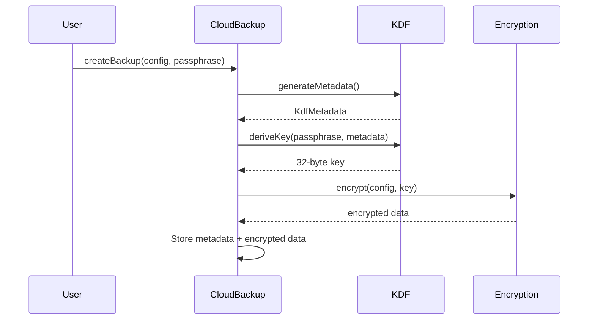
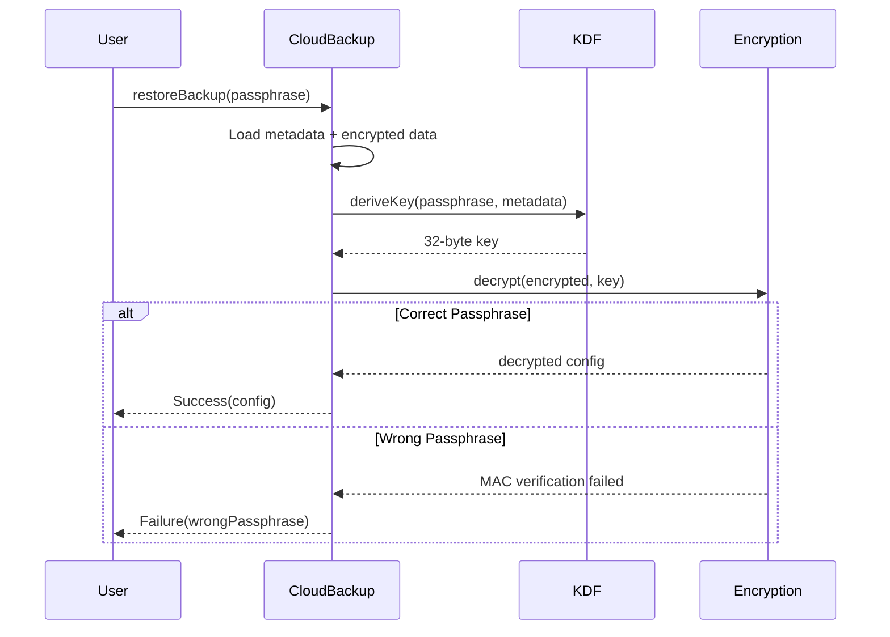

# Crypto Services

## Overview

StyleSync's cryptography services provide secure encryption and key derivation functionality for protecting sensitive data like API keys and cloud backups. The implementation uses industry-standard algorithms and follows security best practices.

## Components

### Encryption Service
Provides authenticated encryption using AES-256-GCM.

### Key Derivation Service
Derives encryption keys from user passphrases using memory-hard algorithms.

### KDF Metadata
Stores key derivation parameters for consistent key regeneration.

## Encryption Service

### Interface

```dart
abstract class EncryptionService {
  /// Encrypts data using AES-256-GCM.
  /// Returns nonce + ciphertext + authentication tag.
  Future<Uint8List> encrypt(Uint8List plaintext, Uint8List key);
  
  /// Decrypts data encrypted with encrypt().
  /// Throws exception if authentication fails.
  Future<Uint8List> decrypt(Uint8List encrypted, Uint8List key);
}
```

### Implementation: AESGCMEncryptionService

**File**: [`lib/core/crypto/encryption_service.dart`](../../lib/core/crypto/encryption_service.dart)

#### Algorithm Details
- **Cipher**: AES-256-GCM (Galois/Counter Mode)
- **Key Size**: 256 bits (32 bytes)
- **Nonce Size**: 96 bits (12 bytes) - randomly generated per encryption
- **Tag Size**: 128 bits (16 bytes) - authentication tag

#### Features
- **Authenticated Encryption**: Provides both confidentiality and integrity
- **MAC Verification**: Detects tampering or corruption
- **Nonce Management**: Automatic unique nonce generation
- **Format**: `[nonce || ciphertext || tag]` - all concatenated

#### Usage Example

```dart
final service = AESGCMEncryptionService();
final key = Uint8List(32); // 256-bit key from KDF

// Encrypt
final plaintext = utf8.encode('sensitive data');
final encrypted = await service.encrypt(plaintext, key);

// Decrypt
final decrypted = await service.decrypt(encrypted, key);
final original = utf8.decode(decrypted);
```

#### Security Properties
- **IND-CCA2 Secure**: Indistinguishable under chosen-ciphertext attack
- **Nonce Reuse Protection**: Random nonces eliminate reuse with same key
- **Integrity Protection**: Authentication tag prevents modification
- **Fast Performance**: Hardware acceleration available on modern platforms

## Key Derivation Service

### Interface

```dart
abstract class KeyDerivationService {
  /// Derives a 32-byte key from a passphrase and metadata.
  Future<Uint8List> deriveKey(String passphrase, KdfMetadata metadata);
  
  /// Generates initial metadata for a new key derivation.
  Future<KdfMetadata> generateMetadata();
}
```

### Implementation: KeyDerivationServiceImpl

**File**: [`lib/core/crypto/key_derivation_service.dart`](../../lib/core/crypto/key_derivation_service.dart)

#### Algorithm Selection

The service automatically selects the best available algorithm based on platform:

| Platform | Algorithm | Reason |
|----------|-----------|--------|
| Android | Argon2id | Native support, optimal security |
| iOS | Argon2id | Native support, optimal security |
| macOS | Argon2id | Native support, optimal security |
| Web | PBKDF2 | Argon2id not available in browsers |
| Linux | PBKDF2 | Argon2id support limited |
| Windows | PBKDF2 | Fallback for compatibility |

### Argon2id Configuration

**Recommended for**: Mobile platforms (Android, iOS, macOS)

#### Parameters
- **Iterations**: 3
- **Memory**: 64 MB (65536 KB)
- **Parallelism**: 4 threads
- **Output**: 32 bytes (256 bits)
- **Salt**: 16 bytes (randomly generated)

#### Security Properties
- **Memory-Hard**: Resistant to GPU/ASIC brute-force attacks
- **Time-Cost Trade-off**: Balances security and user experience (~0.5-1s on mobile)
- **Side-Channel Resistance**: Constant-time operations
- **Hybrid Mode**: Combines Argon2i and Argon2d benefits

#### Why Argon2id?
- Winner of Password Hashing Competition (2015)
- Resistant to time-memory trade-off attacks
- Resistant to side-channel attacks
- Optimal for password-based key derivation

### PBKDF2 Configuration

**Used for**: Web, Linux, Windows platforms

#### Parameters
- **Iterations**: 600,000
- **Hash Function**: HMAC-SHA-512
- **Output**: 32 bytes (256 bits)
- **Salt**: 16 bytes (randomly generated)

#### Security Properties
- **NIST Approved**: SP 800-132 compliant
- **Well-Tested**: Decades of cryptanalysis
- **Universal Support**: Available on all platforms
- **Tunable**: Iteration count adjustable for future-proofing

#### Iteration Count Rationale
- OWASP recommends 600,000+ iterations (2023)
- Balances security with acceptable performance (~1-2s)
- Provides ~64-bit security against brute-force

### Usage Example

```dart
final service = KeyDerivationServiceImpl();

// Generate metadata for new backup
final metadata = await service.generateMetadata();
// metadata.algorithm is Argon2id on mobile, PBKDF2 on web

// Derive key from passphrase
final key = await service.deriveKey('user-passphrase', metadata);
// key.length == 32 (256-bit key for AES-256)

// Store metadata with encrypted data for later decryption
final blob = {
  'kdf': metadata.toJson(),
  'encrypted_data': base64Encode(encryptedData),
};
```

### Performance Characteristics

#### Argon2id Timings (measured on typical devices)
- iPhone 12: ~800ms
- Samsung Galaxy S21: ~700ms
- MacBook Pro M1: ~400ms

#### PBKDF2 Timings (600,000 iterations)
- Chrome (desktop): ~1.5s
- Firefox (desktop): ~1.3s
- Safari (desktop): ~1.2s

## KDF Metadata

**File**: [`lib/core/crypto/kdf_metadata.dart`](../../lib/core/crypto/kdf_metadata.dart)

### Purpose
Stores parameters needed to reproduce key derivation during decryption.

### Data Model

```dart
class KdfMetadata {
  final KdfAlgorithm algorithm;  // argon2id or pbkdf2
  final Uint8List salt;          // 16-byte random salt
  final int iterations;          // KDF iteration count
  final int? memory;             // Argon2 memory (KB)
  final int? parallelism;        // Argon2 threads
}

enum KdfAlgorithm {
  argon2id,
  pbkdf2,
}
```

### JSON Serialization

```json
{
  "algorithm": "argon2id",
  "salt": "base64_encoded_16_byte_salt",
  "iterations": 3,
  "memory": 65536,
  "parallelism": 4
}
```

### Storage
- **Cloud Backups**: Stored alongside encrypted data
- **Local Storage**: Not needed (keys derived on-demand)

## Integration with Cloud Backup

### Backup Encryption Flow



### Backup Restore Flow



## Security Considerations

### Key Management
- **Key Lifetime**: Keys derived on-demand, cleared after use
- **No Key Storage**: Only passphrases and metadata stored
- **Memory Protection**: Keys cleared from memory after operations

### Salt Management
- **Uniqueness**: New random salt for each backup
- **Size**: 16 bytes (128 bits) for adequate entropy
- **Storage**: Stored with encrypted data (not secret)

### Nonce Management
- **Uniqueness**: New random nonce for each encryption
- **Size**: 12 bytes (96 bits) per NIST recommendation
- **Storage**: Prepended to ciphertext

### Passphrase Requirements
- **Minimum Length**: 8 characters recommended
- **Complexity**: User responsibility (no enforced requirements)
- **Never Stored**: Only used for derivation, then discarded

### Algorithm Upgrades
- **Versioning**: KDF metadata includes algorithm version
- **Forward Compatibility**: Old backups remain decryptable
- **Migration**: Future re-encryption with newer algorithms

## Testing

### Unit Tests
**File**: [`test/encryption_service_test.dart`](../../test/encryption_service_test.dart)
- Encrypt/decrypt round-trip
- MAC verification on tampering
- Empty input handling

**File**: [`test/key_derivation_service_test.dart`](../../test/key_derivation_service_test.dart)
- Argon2id derivation
- PBKDF2 derivation
- Platform-specific algorithm selection

### Property-Based Tests
**File**: [`test/crypto_properties_test.dart`](../../test/crypto_properties_test.dart)
- **Property 3**: Encryption round-trip (any plaintext)
- **Property 23**: KDF consistency (same inputs → same key)
- **Property**: Decryption with wrong key fails

## Performance Optimization

### Compute Isolation
Heavy crypto operations run on isolates to avoid blocking UI:

```dart
Future<Uint8List> _deriveWithArgon2id(
  String passphrase,
  KdfMetadata metadata,
) async {
  return compute(_deriveArgon2Bytes, arguments);
}
```

### Platform Optimization
- **Hardware Acceleration**: AES-GCM uses hardware AES-NI when available
- **Native Libraries**: Argon2 uses native C implementation
- **Tuned Parameters**: KDF parameters balanced for mobile performance

## Related Documentation

- [BYOK Manager](./byok-manager.md) - API key management using crypto services
- [Cloud Backup Service](../features/cloud-backup-service.md) - Backup encryption
- [Security Overview](../security/overview.md) - Overall security architecture
- [Testing Strategy](../testing/strategy.md) - Crypto testing approach
