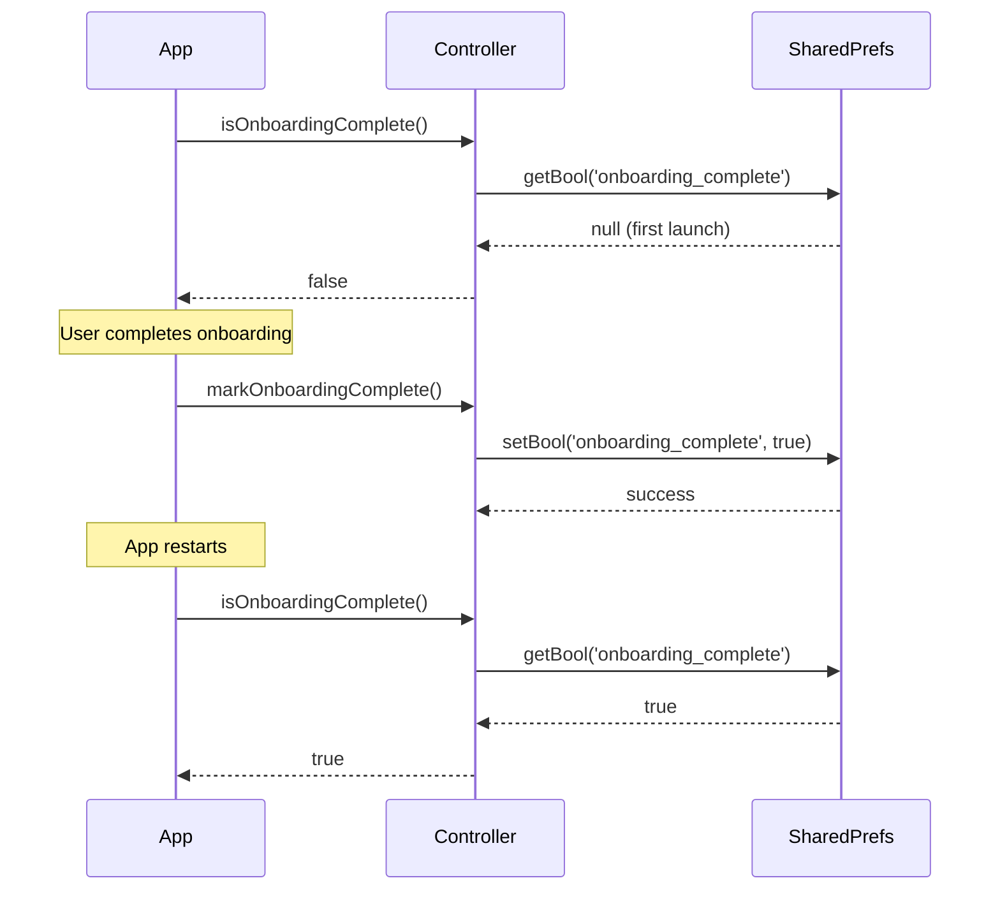

# Onboarding Controller

## Overview

The Onboarding Controller manages the persistence and lifecycle of the user onboarding flow. It tracks whether a user has completed onboarding and ensures this state persists across app restarts using SharedPreferences.

**File**: [`lib/core/onboarding/onboarding_controller.dart`](../../lib/core/onboarding/onboarding_controller.dart)

## Purpose

- Track onboarding completion status
- Persist completion across app restarts
- Provide simple API for onboarding state management
- Enable testing and reset functionality

## Interface

```dart
abstract class OnboardingController {
  /// Marks the onboarding flow as complete.
  /// This state persists across app restarts.
  Future<void> markOnboardingComplete();
  
  /// Checks if the user has completed onboarding.
  /// Returns true if complete, false otherwise.
  Future<bool> isOnboardingComplete();
  
  /// Resets the onboarding state (for testing/debugging).
  /// User will see onboarding again on next app launch.
  Future<void> resetOnboarding();
}
```

## Implementation

**File**: [`lib/core/onboarding/onboarding_controller_impl.dart`](../../lib/core/onboarding/onboarding_controller_impl.dart)

### SharedPreferences Storage

```dart
class OnboardingControllerImpl implements OnboardingController {
  static const String _onboardingCompleteKey = 'onboarding_complete';
  SharedPreferences? _prefs;
  
  Future<void> _ensureInitialized() async {
    _prefs ??= await SharedPreferences.getInstance();
  }
  
  @override
  Future<void> markOnboardingComplete() async {
    await _ensureInitialized();
    await _prefs!.setBool(_onboardingCompleteKey, true);
  }
  
  @override
  Future<bool> isOnboardingComplete() async {
    await _ensureInitialized();
    return _prefs!.getBool(_onboardingCompleteKey) ?? false;
  }
  
  @override
  Future<void> resetOnboarding() async {
    await _ensureInitialized();
    await _prefs!.remove(_onboardingCompleteKey);
  }
}
```

### Key Features
- **Lazy Initialization**: SharedPreferences loaded on first use
- **Thread-Safe**: Single instance prevents race conditions
- **Default Value**: Returns `false` if key doesn't exist
- **Simple API**: Three methods cover all use cases

## State Management Integration

### Riverpod Providers

**File**: [`lib/core/onboarding/onboarding_providers.dart`](../../lib/core/onboarding/onboarding_providers.dart)

#### Controller Provider
```dart
final onboardingControllerProvider = Provider<OnboardingController>((ref) {
  return OnboardingControllerImpl();
});
```

#### Completion Status Provider
```dart
final isOnboardingCompleteProvider = FutureProvider<bool>((ref) async {
  final controller = ref.read(onboardingControllerProvider);
  return await controller.isOnboardingComplete();
});
```

#### State Notifier for UI
```dart
class OnboardingStateNotifier extends StateNotifier<OnboardingState> {
  final OnboardingController _controller;
  
  OnboardingStateNotifier(this._controller) : super(OnboardingState.initial());
  
  Future<void> initialize() async {
    final isComplete = await _controller.isOnboardingComplete();
    if (isComplete) {
      state = state.copyWith(step: OnboardingStep.complete);
    }
  }
  
  Future<void> nextStep() async {
    // Navigate to next step
    final nextStep = _getNextStep(state.step);
    state = state.copyWith(step: nextStep);
    
    // Mark complete when reaching final step
    if (nextStep == OnboardingStep.apiKeyInput) {
      await _controller.markOnboardingComplete();
      state = state.copyWith(step: OnboardingStep.complete);
    }
  }
  
  Future<void> reset() async {
    await _controller.resetOnboarding();
    state = OnboardingState.initial();
  }
}

final onboardingStateProvider = StateNotifierProvider<OnboardingStateNotifier, OnboardingState>((ref) {
  final controller = ref.read(onboardingControllerProvider);
  return OnboardingStateNotifier(controller);
});
```

## Usage Examples

### Check Status at App Launch

```dart
class MyApp extends ConsumerWidget {
  @override
  Widget build(BuildContext context, WidgetRef ref) {
    final onboardingStatus = ref.watch(isOnboardingCompleteProvider);
    
    return MaterialApp(
      home: onboardingStatus.when(
        data: (isComplete) => isComplete ? MainScreen() : OnboardingScreen(),
        loading: () => SplashScreen(),
        error: (_, __) => ErrorScreen(),
      ),
    );
  }
}
```

### Mark Complete After Onboarding

```dart
class ApiKeyInputPage extends ConsumerWidget {
  Future<void> _submitApiKey(WidgetRef ref, String apiKey) async {
    // Store API key
    await ref.read(byokManagerProvider).storeAPIKey(apiKey, projectId);
    
    // Mark onboarding complete
    final notifier = ref.read(onboardingStateProvider.notifier);
    await notifier.nextStep(); // This marks complete internally
  }
}
```

### Reset for Testing

```dart
// In test or debug menu
await ref.read(onboardingControllerProvider).resetOnboarding();
// Restart app to see onboarding again
```

## Onboarding Flow

### State Machine

```
┌─────────┐
│ Initial │ (isComplete == false)
└────┬────┘
     │
     ▼
┌─────────┐
│ Welcome │
└────┬────┘
     │
     ▼
┌──────────┐
│ Tutorial │
└────┬─────┘
     │
     ▼
┌──────────────┐
│ API Key Input│ ────► markOnboardingComplete()
└──────┬───────┘
       │
       ▼
┌────────────┐
│  Complete  │ (isComplete == true)
└────────────┘
```

### Persistence Lifecycle



## Testing

### Property-Based Tests

**File**: [`test/core/onboarding/onboarding_persistence_property_test.dart`](../../test/core/onboarding/onboarding_persistence_property_test.dart)

#### Tested Properties

1. **Persistence After Completion**
   - After `markOnboardingComplete()`, `isOnboardingComplete()` returns `true`
   - Consistent across multiple checks

2. **Persistence Across Instances**
   - Completion status persists across new controller instances
   - Simulates app restarts

3. **Reset Functionality**
   - After `resetOnboarding()`, `isOnboardingComplete()` returns `false`
   - Reset persists across instances

4. **Idempotency**
   - Multiple calls to `markOnboardingComplete()` have same effect as one
   - Multiple calls to `resetOnboarding()` have same effect as one

5. **State Transitions**
   - Final state depends only on last operation
   - Complete → Reset → Complete cycles work correctly

6. **Initial State**
   - Fresh storage always starts with incomplete state

### Unit Tests

**File**: [`test/features/onboarding/onboarding_screen_test.dart`](../../test/features/onboarding/onboarding_screen_test.dart)

- Screen navigation between steps
- Integration with state notifier
- Error handling

## Security Considerations

### Why SharedPreferences?

- **Non-Sensitive Data**: Onboarding status is not sensitive
- **Performance**: Fast synchronous access after initialization
- **Reliability**: Persistent across app updates
- **Standard Practice**: Appropriate for boolean flags

### Not Using Secure Storage

Secure storage is reserved for:
- API keys
- Authentication tokens
- Encryption keys
- User passwords

Onboarding status doesn't require this overhead.

## Performance

### Initialization
- **First Call**: ~10-50ms (SharedPreferences initialization)
- **Subsequent Calls**: <1ms (cached instance)

### Recommendations
- Initialize early in app startup
- Cache result in provider if checking frequently
- Use `FutureProvider` to handle async initialization

## Related Documentation

- [Onboarding System](../features/onboarding/overview.md) - Complete onboarding flow
- [Architecture Overview](../architecture/overview.md) - State management patterns
- [Testing Strategy](../testing/strategy.md) - Property-based testing approach
- [Development Guidelines](../guidelines/development-guidelines.md) - Coding standards
