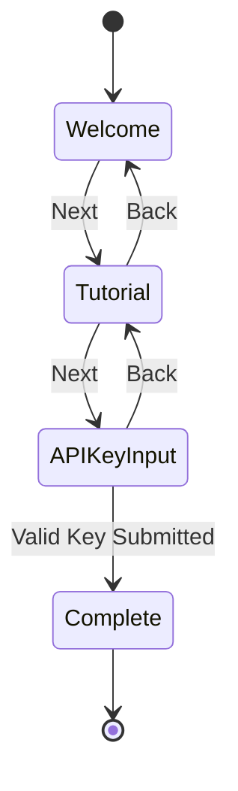
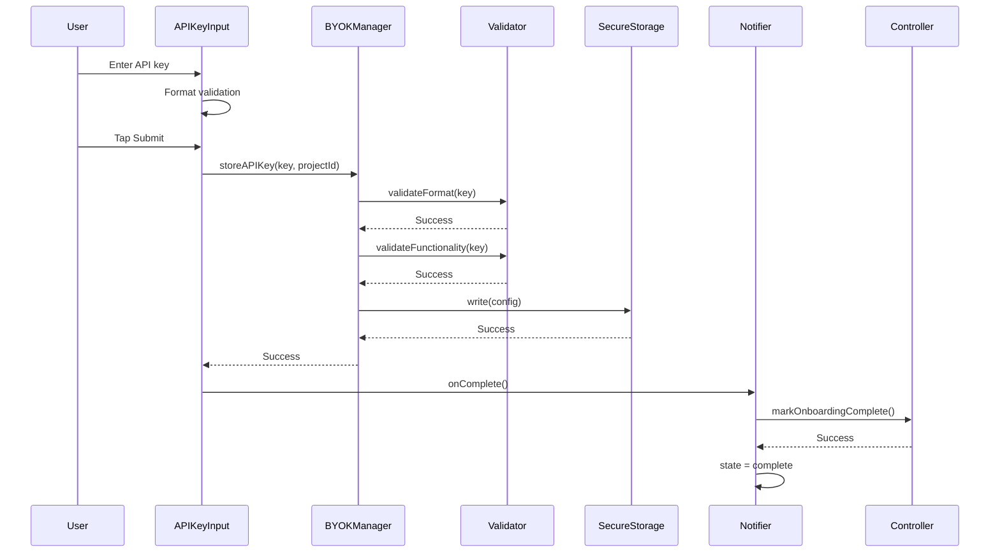

# Onboarding System Overview

## Introduction

The onboarding system provides a multi-step guided experience for new users, introducing them to StyleSync and collecting their Vertex AI API key. The system ensures persistent completion tracking and seamless navigation between onboarding pages.

## Components

### Onboarding Screen
Main container orchestrating the onboarding flow with page navigation and progress indicators.

**File**: [`lib/features/onboarding/onboarding_screen.dart`](../../../lib/features/onboarding/onboarding_screen.dart)

### Welcome Page
Introduces users to StyleSync with branding and key features.

**File**: [`lib/features/onboarding/widgets/welcome_page.dart`](../../../lib/features/onboarding/widgets/welcome_page.dart)

### Tutorial Page
Explains how to use the app and what to expect.

**File**: [`lib/features/onboarding/widgets/tutorial_page.dart`](../../../lib/features/onboarding/widgets/tutorial_page.dart)

### API Key Input Page
Collects and validates the user's Vertex AI API key.

**File**: [`lib/features/onboarding/widgets/api_key_input_page.dart`](../../../lib/features/onboarding/widgets/api_key_input_page.dart)

### Page Indicator
Visual indicator showing progress through onboarding steps.

**File**: [`lib/features/onboarding/widgets/onboarding_page_indicator.dart`](../../../lib/features/onboarding/widgets/onboarding_page_indicator.dart)

## Onboarding Flow

### Step Sequence

```
1. Welcome Page → 2. Tutorial Page → 3. API Key Input Page → Complete
```

### State Management

The onboarding flow uses a `StateNotifier` to manage current step and navigation:

```dart
enum OnboardingStep {
  welcome,
  tutorial,
  apiKeyInput,
  complete,
}

class OnboardingState {
  final OnboardingStep step;
  final bool isLoading;
  final String? error;
  
  const OnboardingState({
    required this.step,
    this.isLoading = false,
    this.error,
  });
}
```

### Navigation Flow



## Page Details

### Welcome Page

**Purpose**: First impression and brand introduction

**Content**:
- App logo and name
- Welcome message
- Key value propositions
- "Get Started" button

**Actions**:
- Next → Tutorial Page

### Tutorial Page

**Purpose**: Educate users on app features

**Content**:
- Feature explanations
- Usage guidelines
- Privacy and security highlights
- Navigation buttons

**Actions**:
- Back → Welcome Page
- Next → API Key Input Page

### API Key Input Page

**Purpose**: Collect and validate Vertex AI API key

**Content**:
- Instructions for obtaining API key
- Text input field with validation
- Project ID input
- Real-time format validation
- Submit button

**Validation**:
1. Format check (starts with "AIza", 39 characters)
2. Functional test (API call to verify key works)

**Actions**:
- Back → Tutorial Page
- Submit (valid key) → Mark onboarding complete → Main app

**Error Handling**:
- Invalid format → Show inline error
- Invalid key → Show error message
- Network error → Show retry option

## Implementation Details

### OnboardingScreen Structure

```dart
class OnboardingScreen extends ConsumerWidget {
  @override
  Widget build(BuildContext context, WidgetRef ref) {
    final state = ref.watch(onboardingStateProvider);
    
    return Scaffold(
      body: SafeArea(
        child: Column(
          children: [
            // Progress indicator
            OnboardingPageIndicator(currentStep: state.step),
            
            // Page content
            Expanded(
              child: PageView(
                controller: _pageController,
                physics: NeverScrollableScrollPhysics(), // Controlled navigation
                children: [
                  WelcomePage(onNext: () => notifier.nextStep()),
                  TutorialPage(
                    onNext: () => notifier.nextStep(),
                    onBack: () => notifier.previousStep(),
                  ),
                  ApiKeyInputPage(
                    onBack: () => notifier.previousStep(),
                    onComplete: () => notifier.complete(),
                  ),
                ],
              ),
            ),
          ],
        ),
      ),
    );
  }
}
```

### State Notifier Integration

```dart
class OnboardingStateNotifier extends StateNotifier<OnboardingState> {
  final OnboardingController _controller;
  
  void nextStep() {
    final currentIndex = state.step.index;
    if (currentIndex < OnboardingStep.complete.index) {
      state = state.copyWith(
        step: OnboardingStep.values[currentIndex + 1],
      );
    }
  }
  
  void previousStep() {
    final currentIndex = state.step.index;
    if (currentIndex > OnboardingStep.welcome.index) {
      state = state.copyWith(
        step: OnboardingStep.values[currentIndex - 1],
      );
    }
  }
  
  Future<void> complete() async {
    await _controller.markOnboardingComplete();
    state = state.copyWith(step: OnboardingStep.complete);
  }
}
```

## API Key Submission Flow



## Persistence

### Onboarding Completion

The onboarding system tracks completion using the [Onboarding Controller](../../core-services/onboarding-controller.md):

- **Storage**: SharedPreferences
- **Key**: `onboarding_complete`
- **Value**: boolean
- **Lifecycle**: Persists across app restarts and updates

### API Key Storage

API keys are stored using [Secure Storage Service](../../core-services/secure-storage-service.md):

- **Storage**: Platform-native (Keychain/Keystore)
- **Encryption**: Hardware-backed when available
- **Lifecycle**: Persists until user logs out or deletes

## Testing

### Widget Tests

**File**: [`test/features/onboarding/onboarding_screen_test.dart`](../../../test/features/onboarding/onboarding_screen_test.dart)

- Screen renders correctly
- Navigation between pages
- Progress indicator updates
- State management integration

### Page-Specific Tests

**Files**:
- [`test/features/onboarding/widgets/welcome_page_test.dart`](../../../test/features/onboarding/widgets/welcome_page_test.dart)
- [`test/features/onboarding/widgets/tutorial_page_test.dart`](../../../test/features/onboarding/widgets/tutorial_page_test.dart)
- [`test/features/onboarding/widgets/api_key_input_page_test.dart`](../../../test/features/onboarding/widgets/api_key_input_page_test.dart)

Tests cover:
- Widget rendering
- Button interactions
- Callback execution
- Error state display

## User Experience

### Design Principles
- **Progressive Disclosure**: Information revealed step-by-step
- **Clear Navigation**: Obvious next steps and back options
- **Validation Feedback**: Immediate feedback on API key validation
- **Error Recovery**: Clear error messages and retry options
- **Skip-Free**: Users must complete all steps (ensures API key collected)

### Accessibility
- Clear labels and instructions
- High-contrast UI elements
- Touch-friendly button sizes
- Screen reader support

## Related Documentation

- [Onboarding Screen](./onboarding-screen.md) - Main screen implementation
- [Welcome Page](./welcome-page.md) - Welcome page details
- [Tutorial Page](./tutorial-page.md) - Tutorial page details
- [API Key Input Page](./api-key-input-page.md) - API key collection
- [Page Indicator](./page-indicator.md) - Progress indicator
- [Onboarding Controller](../../core-services/onboarding-controller.md) - Persistence logic
- [BYOK Manager](../../core-services/byok-manager.md) - API key management
