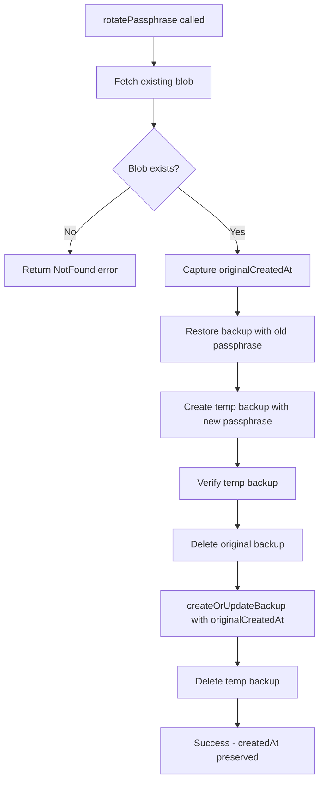

# Design: Preserving Original `createdAt` in CloudBackupService

## Problem Statement

In [`CloudBackupServiceImpl.createOrUpdateBackup()`](lib/core/byok/cloud_backup_service.dart:133), the original `createdAt` timestamp is lost during passphrase rotation because:

1. The [`rotatePassphrase()`](lib/core/byok/cloud_backup_service.dart:383) method deletes the original backup at line 458
2. Then calls [`createOrUpdateBackup()`](lib/core/byok/cloud_backup_service.dart:471) to create a new backup
3. Inside `createOrUpdateBackup()`, [`_tryGetExistingBlob()`](lib/core/byok/cloud_backup_service.dart:709) attempts to fetch the existing blob to preserve `createdAt`
4. But the blob no longer exists because it was just deleted

**Result**: The backup's `createdAt` timestamp is reset to the current time instead of preserving the original creation date.

## Current Implementation Analysis

### Key Methods

#### [`createOrUpdateBackup()`](lib/core/byok/cloud_backup_service.dart:133)
```dart
Future<Result<void>> createOrUpdateBackup(
  APIKeyConfig config,
  String passphrase,
) async {
  // ... validation and encryption ...
  
  // Step 5: Fetch existing blob to preserve createdAt timestamp
  final existingBlob = await _tryGetExistingBlob();  // Returns null if deleted!

  // Step 6: Create CloudBackupBlob
  final now = DateTime.now().toUtc();
  final blob = CloudBackupBlob(
    version: CloudBackupBlob.currentVersion,
    kdfMetadata: kdfMetadata,
    encryptedData: base64Encode(encryptedData),
    createdAt: existingBlob?.createdAt ?? now,  // Falls back to now if no existing blob
    updatedAt: now,
  );
  // ...
}
```

#### [`_tryGetExistingBlob()`](lib/core/byok/cloud_backup_service.dart:709)
```dart
Future<CloudBackupBlob?> _tryGetExistingBlob() async {
  try {
    if (_auth.currentUser == null) return null;
    
    final ref = _storage.ref(_getBackupPath());
    final data = await ref.getData();
    if (data == null) return null;
    
    final blobJson = utf8.decode(data);
    final blobMap = jsonDecode(blobJson) as Map<String, dynamic>;
    return CloudBackupBlob.fromJson(blobMap);
  } catch (_) {
    return null;  // Any error means we can't get the existing blob
  }
}
```

#### [`rotatePassphrase()`](lib/core/byok/cloud_backup_service.dart:383) - The Problematic Flow
```dart
Future<Result<void>> rotatePassphrase(
  String oldPassphrase,
  String newPassphrase,
) async {
  // Step 1: Restore backup with old passphrase
  final restoreResult = await restoreBackup(oldPassphrase);
  // ...
  
  // Step 4a: Delete the original backup  <-- PROBLEM: createdAt is lost here
  final deleteOriginalResult = await deleteBackup();
  // ...
  
  // Step 4b: Upload to final path  <-- _tryGetExistingBlob() returns null
  final uploadFinalResult = await createOrUpdateBackup(config, newPassphrase);
  // ...
}
```

### [`CloudBackupBlob`](lib/core/byok/models/cloud_backup_blob.dart:8) Model
```dart
class CloudBackupBlob {
  final int version;
  final KdfMetadata kdfMetadata;
  final String encryptedData;
  final DateTime createdAt;    // Original creation timestamp
  final DateTime updatedAt;    // Last update timestamp
  // ...
}
```

## Callers of `createOrUpdateBackup`

| Location | Method | Context |
|----------|--------|---------|
| [`cloud_backup_service.dart:471`](lib/core/byok/cloud_backup_service.dart:471) | `rotatePassphrase()` | **AFFECTED** - Called after `deleteBackup()`, loses `createdAt` |
| [`byok_manager.dart:350`](lib/core/byok/byok_manager.dart:350) | `updateAPIKey()` | Not affected - backup not deleted before call |
| [`byok_manager.dart:400`](lib/core/byok/byok_manager.dart:400) | `enableCloudBackup()` | Not affected - creates new backup or updates existing |
| [`byok_manager_test.dart:133`](test/byok_manager_test.dart:133) | `MockCloudBackupService` | Mock implementation - needs signature update |

## Proposed Solution

### Option 1: Add Optional `createdAt` Parameter (Recommended)

Add an optional `createdAt` parameter to `createOrUpdateBackup()` that allows callers to explicitly preserve the original timestamp.

#### Abstract Interface Change
```dart
// lib/core/byok/cloud_backup_service.dart (abstract class)
Future<Result<void>> createOrUpdateBackup(
  APIKeyConfig config,
  String passphrase, {
  DateTime? createdAt,  // NEW: Optional timestamp to preserve
});
```

#### Implementation Change
```dart
// lib/core/byok/cloud_backup_service.dart (CloudBackupServiceImpl)
@override
Future<Result<void>> createOrUpdateBackup(
  APIKeyConfig config,
  String passphrase, {
  DateTime? createdAt,  // NEW parameter
}) async {
  // ... existing validation and encryption code ...

  // Step 5: Determine createdAt timestamp
  // Priority: 1) Explicit parameter, 2) Existing blob, 3) Current time
  final existingBlob = await _tryGetExistingBlob();
  final now = DateTime.now().toUtc();
  
  final blob = CloudBackupBlob(
    version: CloudBackupBlob.currentVersion,
    kdfMetadata: kdfMetadata,
    encryptedData: base64Encode(encryptedData),
    createdAt: createdAt ?? existingBlob?.createdAt ?? now,  // CHANGED
    updatedAt: now,
  );
  // ...
}
```

#### Caller Update: `rotatePassphrase()`
```dart
Future<Result<void>> rotatePassphrase(
  String oldPassphrase,
  String newPassphrase,
) async {
  // ... existing code ...
  
  // Step 1: Restore backup and CAPTURE createdAt
  final blobResult = await _fetchAndParseBlob();  // Get blob before deletion
  if (blobResult.isFailure) {
    return Failure(blobResult.errorOrNull!);
  }
  final originalCreatedAt = blobResult.valueOrNull!.createdAt;  // CAPTURE
  
  final restoreResult = await restoreBackup(oldPassphrase);
  // ... existing validation ...
  
  // ... Steps 2-4a unchanged ...
  
  // Step 4b: Upload to final path with preserved createdAt
  final uploadFinalResult = await createOrUpdateBackup(
    config, 
    newPassphrase,
    createdAt: originalCreatedAt,  // PASS preserved timestamp
  );
  // ...
}
```

### Files Requiring Changes

| File | Change Required |
|------|-----------------|
| [`lib/core/byok/cloud_backup_service.dart`](lib/core/byok/cloud_backup_service.dart) | 1. Update abstract interface signature (line 29-32)<br>2. Update implementation signature (line 133-136)<br>3. Update blob creation logic (line 169-176)<br>4. Update `rotatePassphrase()` to capture and pass `createdAt` (lines 383-512) |
| [`test/byok_manager_test.dart`](test/byok_manager_test.dart) | Update `MockCloudBackupService.createOrUpdateBackup()` signature (line 132-145) |

### Detailed Implementation Steps

#### Step 1: Update Abstract Interface
Location: [`lib/core/byok/cloud_backup_service.dart:29-32`](lib/core/byok/cloud_backup_service.dart:29)

```dart
// BEFORE
Future<Result<void>> createOrUpdateBackup(
  APIKeyConfig config,
  String passphrase,
);

// AFTER
Future<Result<void>> createOrUpdateBackup(
  APIKeyConfig config,
  String passphrase, {
  DateTime? createdAt,
});
```

#### Step 2: Update Implementation Signature
Location: [`lib/core/byok/cloud_backup_service.dart:133-136`](lib/core/byok/cloud_backup_service.dart:133)

```dart
// BEFORE
@override
Future<Result<void>> createOrUpdateBackup(
  APIKeyConfig config,
  String passphrase,
) async {

// AFTER
@override
Future<Result<void>> createOrUpdateBackup(
  APIKeyConfig config,
  String passphrase, {
  DateTime? createdAt,
}) async {
```

#### Step 3: Update Blob Creation Logic
Location: [`lib/core/byok/cloud_backup_service.dart:165-176`](lib/core/byok/cloud_backup_service.dart:165)

```dart
// BEFORE
// Step 5: Fetch existing blob to preserve createdAt timestamp
final existingBlob = await _tryGetExistingBlob();

// Step 6: Create CloudBackupBlob
final now = DateTime.now().toUtc();
final blob = CloudBackupBlob(
  version: CloudBackupBlob.currentVersion,
  kdfMetadata: kdfMetadata,
  encryptedData: base64Encode(encryptedData),
  createdAt: existingBlob?.createdAt ?? now,
  updatedAt: now,
);

// AFTER
// Step 5: Determine createdAt timestamp
// Priority: 1) Explicit parameter, 2) Existing blob, 3) Current time
final existingBlob = createdAt == null ? await _tryGetExistingBlob() : null;
final now = DateTime.now().toUtc();

// Step 6: Create CloudBackupBlob
final blob = CloudBackupBlob(
  version: CloudBackupBlob.currentVersion,
  kdfMetadata: kdfMetadata,
  encryptedData: base64Encode(encryptedData),
  createdAt: createdAt ?? existingBlob?.createdAt ?? now,
  updatedAt: now,
);
```

**Note**: The optimization `createdAt == null ? await _tryGetExistingBlob() : null` avoids an unnecessary network call when `createdAt` is explicitly provided.

#### Step 4: Update `rotatePassphrase()` Method
Location: [`lib/core/byok/cloud_backup_service.dart:383-512`](lib/core/byok/cloud_backup_service.dart:383)

The key change is to capture `createdAt` before any deletion occurs:

```dart
@override
Future<Result<void>> rotatePassphrase(
  String oldPassphrase,
  String newPassphrase,
) async {
  try {
    // Validate user is authenticated
    if (_auth.currentUser == null) {
      return const Failure(BackupError(
        'User must be authenticated to rotate passphrase',
        BackupErrorType.storageError,
      ));
    }

    // NEW: Capture original createdAt before any operations
    final blobResult = await _fetchAndParseBlob();
    if (blobResult.isFailure) {
      return Failure(blobResult.errorOrNull!);
    }
    final originalCreatedAt = blobResult.valueOrNull!.createdAt;

    // Step 1: Restore backup with old passphrase to get the config
    final restoreResult = await restoreBackup(oldPassphrase);
    // ... rest of existing code ...

    // Step 4b: Upload to final path with preserved createdAt
    final uploadFinalResult = await createOrUpdateBackup(
      config, 
      newPassphrase,
      createdAt: originalCreatedAt,  // PASS preserved timestamp
    );
    // ... rest of existing code ...
  }
  // ... catch blocks unchanged ...
}
```

#### Step 5: Update Mock in Tests
Location: [`test/byok_manager_test.dart:132-145`](test/byok_manager_test.dart:132)

```dart
// BEFORE
@override
Future<Result<void>> createOrUpdateBackup(
  APIKeyConfig config,
  String passphrase,
) async {
  createCallCount++;
  // ...
}

// AFTER
@override
Future<Result<void>> createOrUpdateBackup(
  APIKeyConfig config,
  String passphrase, {
  DateTime? createdAt,
}) async {
  createCallCount++;
  // Optionally track createdAt for testing
  // ...
}
```

## Edge Cases to Consider

### 1. First-time Backup Creation
- **Scenario**: No existing backup, no `createdAt` parameter passed
- **Expected**: Uses `DateTime.now()` as `createdAt`
- **Status**: ✅ Handled by fallback chain

### 2. Normal Update (No Deletion)
- **Scenario**: Existing backup, no `createdAt` parameter passed
- **Expected**: Preserves existing `createdAt` via `_tryGetExistingBlob()`
- **Status**: ✅ Handled by existing logic

### 3. Passphrase Rotation
- **Scenario**: Backup deleted before `createOrUpdateBackup()` call
- **Expected**: Uses explicitly passed `createdAt` parameter
- **Status**: ✅ Fixed by this design

### 4. Network Failure During `_fetchAndParseBlob()`
- **Scenario**: Cannot fetch blob to capture `createdAt` before rotation
- **Expected**: Rotation fails early with appropriate error
- **Status**: ✅ Handled - `_fetchAndParseBlob()` returns `Failure` which propagates

### 5. Concurrent Modifications
- **Scenario**: Another device modifies backup between capture and rotation
- **Expected**: Acceptable race condition - the captured `createdAt` is still valid
- **Status**: ✅ Acceptable behavior

### 6. `_uploadToPath()` Helper Method
- **Scenario**: Used for temp backup during rotation
- **Expected**: Does not need `createdAt` parameter - temp backups are transient
- **Status**: ✅ No change needed

## Backward Compatibility

The solution maintains full backward compatibility:

1. **Optional Parameter**: The `createdAt` parameter is optional with a default of `null`
2. **Existing Callers**: All existing callers continue to work without modification
3. **Fallback Behavior**: When `createdAt` is not provided, the existing logic applies

## Testing Recommendations

### New Test Cases for `CloudBackupServiceImpl`

```dart
group('createOrUpdateBackup createdAt preservation', () {
  test('uses explicit createdAt when provided', () async {
    final explicitTime = DateTime.utc(2020, 1, 1);
    await service.createOrUpdateBackup(config, passphrase, createdAt: explicitTime);
    
    final blob = await fetchBlob();
    expect(blob.createdAt, equals(explicitTime));
  });

  test('preserves existing createdAt when no parameter provided', () async {
    // Create initial backup
    await service.createOrUpdateBackup(config, passphrase);
    final originalBlob = await fetchBlob();
    
    // Update backup
    await service.createOrUpdateBackup(updatedConfig, passphrase);
    final updatedBlob = await fetchBlob();
    
    expect(updatedBlob.createdAt, equals(originalBlob.createdAt));
  });

  test('rotatePassphrase preserves original createdAt', () async {
    // Create initial backup
    await service.createOrUpdateBackup(config, passphrase);
    final originalBlob = await fetchBlob();
    
    // Rotate passphrase
    await service.rotatePassphrase(passphrase, newPassphrase);
    final rotatedBlob = await fetchBlob();
    
    expect(rotatedBlob.createdAt, equals(originalBlob.createdAt));
    expect(rotatedBlob.updatedAt.isAfter(originalBlob.updatedAt), isTrue);
  });
});
```

### Update Existing Mock Tests

The mock in [`test/byok_manager_test.dart`](test/byok_manager_test.dart) should be updated to optionally track the `createdAt` parameter for verification in tests.

## Summary

This design adds an optional `createdAt` parameter to `createOrUpdateBackup()` that:

1. **Solves the Problem**: Allows `rotatePassphrase()` to explicitly preserve the original timestamp
2. **Maintains Compatibility**: All existing callers work without modification
3. **Follows Existing Patterns**: Uses the same optional parameter pattern seen elsewhere in the codebase
4. **Minimal Changes**: Only 4 files need modification, with surgical changes to each


